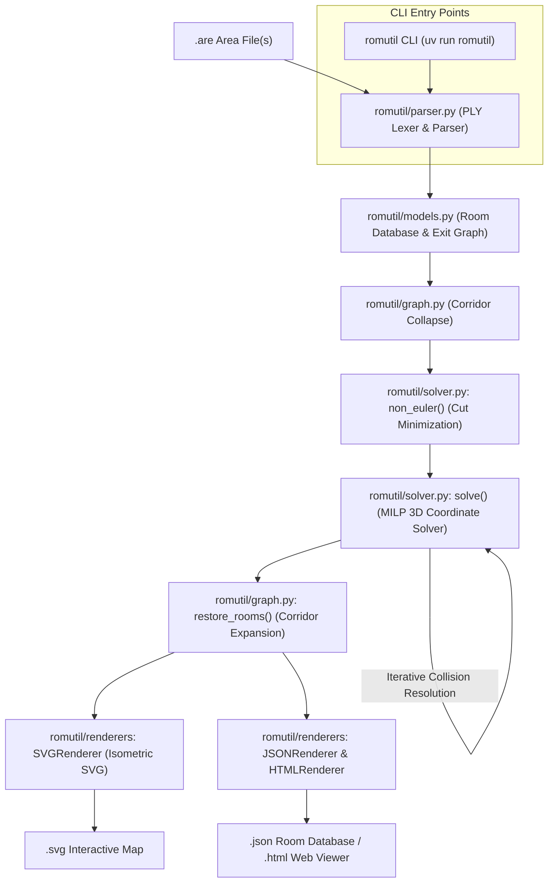

# ROMUtil Architecture & Design Guide

**ROMUtil** is an automated pipeline that parses text-based area files (`.are`) from **ROM (Rivers of MUD / DikuMUD)** codebases, calculates consistent 3D geometric coordinates `(x, y, z)` for rooms, resolves non-Euclidean contradictions and spatial collisions, and generates interactive isometric SVG map visualizations.

---

## 1. Problem Space & Challenges

In text-based MUDs, areas were authored manually by human builders over decades. Unlike tile-based maps, MUD areas are arbitrary directed graphs with cardinal exits:
- **Non-Euclidean Topologies**: Moving East and then West does not guarantee you return to the same room. Loops may have unequal opposing path lengths (e.g., 3 rooms North, 2 rooms East, 2 rooms South, 2 rooms West).
- **Corridors & Mazes**: Long straight hallways cause high solver complexity, while mazes contain deliberate cycles and one-way drops.
- **Verticality (Z-Axis)**: Areas have multiple elevation levels connected by `Up` and `Down` exits.
- **Zone Boundaries**: Exits often point to rooms outside the file (`VNUM`s not in the area) or unresolved destinations (`dst == -1`).

ROMUtil solves this layout challenge by combining **graph algorithms** with **Mixed-Integer Linear Programming (MILP)** via Coin-OR CBC and Pyomo.

---

## 2. System Architecture & Pipeline

The project is structured as a modular Python package ([`romutil/`](./romutil)) with a unified console CLI entry point:



The pipeline executes in five distinct phases:
1. **Lexing & Parsing**: Reads `.are` files with Latin-1 fallback into structured Python objects.
2. **Corridor Reduction**: Collapses straight hallways to reduce graph and solver complexity.
3. **Eulerian / Cut Optimization**: Detects geometric inconsistencies and marks minimal exit cuts.
4. **Iterative MILP Placement**: Assigns integer coordinates `(x, y, z)` while lazily preventing exit line collisions.
5. **Restoration & Isometric Plotting**: Re-expands hallways and renders an SVG with interactive mouseover popups.

---

## 3. Package & Module Structure

```text
ROMUtil/
├── romutil/                     # Core Python package
│   ├── __init__.py              # Package public API exports
│   ├── cli.py                   # Modernized CLI (pathlib.Path) & entry point
│   ├── exporter.py              # Backward-compatibility facade for export functions
│   ├── graph.py                 # Corridor collapsing, restoration, and mfas
│   ├── models.py                # Direction, Room, and Exit domain models
│   ├── parser.py                # PLY Lexer & LALR Parser with resilient encoding
│   ├── plotter.py               # Backward-compatibility facade for Plotter
│   ├── renderers/               # Unified map renderer architecture
│   │   ├── __init__.py          # RENDERERS registry, get_renderer, and render_map
│   │   ├── base.py              # BaseRenderer protocol definition
│   │   ├── html.py              # Standalone interactive HTML/JS map viewer renderer
│   │   ├── json.py              # Structured JSON map data renderer & serializer
│   │   └── svg.py               # Oblique isometric SVG vector map renderer
│   ├── solver.py                # Pyomo MILP optimization and overlap detection
│   └── templates/               # Embedded web application templates
│       ├── __init__.py
│       └── viewer.html          # Self-contained HTML/JS map viewer asset
├── pyproject.toml               # PEP 621 package metadata & script definitions
├── uv.lock                      # Pinned dependency lockfile managed by uv
└── tests/                       # Comprehensive unit and integration test suite
```

---

## 4. Component Architecture

### 4.1. Parsing Engine — [`romutil/parser.py`](./romutil/parser.py)

The parsing engine ingests text-based MUD area files across historical and modern DikuMUD derivative dialects (ROM 2.4, Merc 2.1/2.2, Envy 1.0/2.0, CircleMUD / DikuMUD III, and DikuMUD Alfa / Gamma) and constructs structured in-memory area representations using Python PLY (`ply.lex` and `ply.yacc`).

- **DikuMUD Alfa / Gamma Monolithic Ingestion & VNUM 0 ("The Void") Architecture**:
  - Ingests monolithic `.wld` files (such as `tinyworld.wld`) containing unpartitioned room definitions across multiple zones without `#AREA` metadata headers or `#ROOMS` section boundaries.
  - Accommodates Diku Alfa's 3-parameter room definition lines (`<zone_number> <room_flags> <sector_type>`) and normalizes trailing EOF sentinels (`#99999\n$~`, `#0\n$~`, `$~`, `$\n`).
  - Resolves semantic overloading of VNUM `0` ("The Void"): in DikuMUD Alfa, room `#0` is a valid, traversable room with cardinal exits, while in ROM/Merc derivations `#0` functions as a section terminator sentinel. The lexer utilizes contextual lookahead in `t_NULL`: when `#0` is immediately followed by a tilde-terminated room title string, it emits `VNUM(0)` to enter `p_room`; when followed by section boundaries or EOF, it emits `NULL` to close `p_sections` without LALR(1) shift/reduce conflicts.
  - Generates synthesized `AreaHeader` metadata when standalone or monolithic `.wld` files are processed by the CLI or plotting pipelines, determining bounding intervals $[V_{\min}, V_{\max}]$ from parsed rooms and deriving human-readable area names from filename stems.
  - Domain abstractions (`RoomDef`, `Room`, `Exit`) and MILP solver formulations treat node `0` and edges to destination `0` symmetrically with non-zero nodes, supporting full vertical layering and reciprocal one-way exit resolution.
- **Dialect Normalization Layer (`normalize_dialect_buffer`)**:
  - Preprocesses input text buffers prior to lexical analysis to ensure deterministic state transitions in PLY's LALR(1) state machine without lookahead ambiguity.
  - Converts Envy `#AREADATA ... End` key-value blocks and Merc single-line `#AREA { ... } ...~` headers into canonical 4-line `#AREA` metadata.
  - Evaluates piped bitmask expressions (e.g. `4|8|1024` evaluates to composite integer `1036`) while preserving alpha string flags.
  - Strips unsupported dialect-specific sections (`#GAMES`, `#CLANS`, `#ECONOMY`, `#OLC`).
  - Standardizes CircleMUD / DikuMUD EOF delimiters (`$~` and `$`) into standard `#$` markers.
- **Split-World Directory Loader (`parse_circlemud_directory`)**:
  - Ingests split-file CircleMUD 3.x and tbaMUD world hierarchies where rooms and zones are decoupled across dedicated files (`*.wld` room records, `*.zon` reset and zone headers).
  - Directory resolution supports flat folder structures (`30.wld`, `30.zon`), canonical hierarchical `lib/world/` layouts (`wld/` and `zon/` subdirectories), and explicit `index` manifest files listing active zone numbers.
  - Zone metadata parsing (`parse_circlemud_zone_file`) decodes `.zon` headers (zone virtual number, zone name, author/builder, top and bottom room boundaries, lifespan, and reset modes) as well as reset commands (`M`, `O`, `G`, `E`, `P`, `D`, `R`, `V`).
  - Zone binding matches rooms to zone headers by filename stem correspondence, falling back to dynamic VNUM interval containment ($V_{\min} \le \text{vnum}(r) \le V_{\max}$). When zone files are omitted, fallback headers are synthesized from room bounds.
  - Merges parsed rooms across all `.wld` files and zone resets into a unified `AreaData` domain model for seamless downstream layout solving.
- **[`Lexer`](./romutil/parser.py)**:
  - Employs dedicated lexer states (`INITIAL`, `string`, `line`, `optional`) to parse mixed-format data.
  - Recognizes tilde-terminated multiline text strings (`~`), cardinal door tokens (`D0` through `D5`), and canonical or dialect section aliases (`#ROOMDATA`, `#MOBDATA`, `#NEWOBJECTS`, `#OBJECTDATA`).
- **[`Parser`](./romutil/parser.py)**:
  - An LALR(1) grammar that extracts room topology (VNUMs, titles, descriptions, flags, sector types) and directional exits (destination VNUMs, door keywords, lock flags).
  - Accommodates variable room parameters (including CircleMUD's 6-field room lines) and variable door parameter definitions (handling 1 to 5 numeric values for legacy Merc reverse pointers).
  - Intersperses comment handling (`*`) across `#RESETS` and `#SPECIALS` blocks and tolerates non-spatial sections (`#SHOPS`, `#MOBILES`, `#HELPS`, `#SOCIALS`).
  - Reads files using `latin-1` decoding with replacement fallback to handle vintage MUD files containing non-UTF-8 character data.
- **Dialect Specifications & Repository Catalog**:
  - Comprehensive format specifications, grammar variants across MUD lineages (ROM, Merc, Envy, DikuMUD, CircleMUD, SMAUG, ANATOLIA, ACK!MUD), and verified upstream GitHub repositories are cataloged in [`docs/MUD_REPOSITORIES.md`](./docs/MUD_REPOSITORIES.md).

---

### 4.2. Domain Models & Graph Representation — [`romutil/models.py`](./romutil/models.py)

The domain models define the spatial and topological primitives used throughout the graph layout and rendering pipeline:

- **[`Direction`](./romutil/models.py)**:
  An enumeration representing the 6 degrees of spatial movement (`North`, `East`, `Up`, `South`, `West`, `Down`).
  - Defines opposing directional symmetry via `invert() = (dir + 3) % 6`.
- **[`Exit`](./romutil/models.py)**:
  Represents a directed spatial edge between `src` and `dst` with an associated direction and distance span.
  - Implements symmetrical equality (`__eq__`) and hash invariance so opposing exits (`A -> B East` and `B -> A West`) map to the same logical edge.
  - Tracks whether an exit is strictly `one_way` (lacking a reciprocal return path).
- **[`Room`](./romutil/models.py)**:
  The mutable room node in the spatial graph. Stores integer coordinates `(x, y, z)`, connected exits, and a `fixups` queue of collapsed hallway nodes.
  - Flags synthetic boundary rooms (`room.dummy = True`) created for unresolved or out-of-area destinations.
- **[`AreaData`](./romutil/models.py)**:
  Top-level container holding strongly-typed AST definitions (`AreaHeader`, `RoomDef`, `ExitDef`, `ObjectDef`, `MobileDef`, `ResetDef`, `ShopDef`, `SpecialDef`, `HelpDef`, `SocialDef`, `ExtraDescr`), guaranteeing type safety across pipeline stages.

---

### 4.3. Graph Simplification — [`romutil/graph.py`](./romutil/graph.py)

Before invoking the mathematical solver, the graph is simplified to minimize variables:

1. **Hallway Condensation**:
   Rooms with exactly two opposite exits (e.g., East and West) are straight corridors. `graph()` trims the intermediate room, updates neighbor exits to span the combined distance, and registers the collapsed room in `parent.fixups`.
2. **External & Unresolved Exit Handling**:
   - Exits pointing to `-1` (incomplete rooms) are assigned a synthetic VNUM `max(rdb.keys()) + 1`.
   - Exits leading outside the area file create lightweight `dummy` rooms (`room.dummy = True`) so boundaries can still be routed without crashing.
3. **Connected Components**:
   Uses `networkx.connected_components()` to split disconnected areas into independent subgraphs, solving and plotting each component separately.
4. **Spatial Candidate Tracking**:
   Precomputes non-incident candidate exit pairs in a hash set to provide $O(1)$ candidate retrieval and retirement for downstream sweep-line spatial collision detection in [`romutil/solver.py`](./romutil/solver.py).
5. **Solver Termination Handling & Feasible Solution Recovery**:
   Coordinates room coordinate extraction from the optimization engine. If CBC achieves `optimal` termination, coordinates are extracted and normalized. If CBC terminates with `maxTimeLimit` or `feasible` and the model has evaluated variable values, the best integer-feasible coordinates are preserved rather than collapsed to $(0, 0, 0)$. Only irrecoverable solver failures (infeasible or unassigned coordinates) trigger coordinate zeroing.

---

### 4.4. Mathematical Layout Optimization — [`romutil/solver.py`](./romutil/solver.py)

The layout is formulated as a Mixed-Integer Linear Program (MILP) using **Pyomo** and solved with the **Coin-OR CBC** solver:

#### Variables:
- `m.x[r]`, `m.y[r]`, `m.z[r]`: Integer coordinates for each room `r`.
- `m.cut[e]`: Binary variable indicating if an exit `e` is "cut" (relaxed from geometric constraints).
- `m.l_max[e]`: Positive integer measuring the maximum rendered length of exit `e`.
- `m.one_ways`: Variables bounding Manhattan distance between one-way endpoints.

#### Constraints:
1. **Relative Distance Constraints**:
   For an exit from room $u$ to room $v$ in direction East:
   $$x_v - x_u + M \cdot \text{cut}_e \ge l_{\min}(e)$$
   $$x_v - x_u - M \cdot \text{cut}_e \le l_{\max}(e)$$
   *(where $M$ is a big-M upper bound equal to the sum of all exit lengths).*
2. **Axis Alignment**:
   Non-cardinal axes are constrained to match (e.g., East exits enforce $y_u = y_v$ and $z_u = z_v$ unless cut).
3. **Cut Relaxation**:
   If an area contains contradictory cycles (e.g., a maze or non-Euclidean loop), `cut[e] = 1` disables the strict geometric distance requirement for that edge.

#### Objective Function:
$$\min \left( M^2 \sum \text{cut}_e + \sum l_{\max}(e) + \sum \text{dist}_{\text{one-way}} \right)$$
- Heavy penalty ($M^2$) prevents cutting exits unless mathematically unavoidable.
- Minimizes overall exit lengths to keep rooms compact.
- Keeps one-way endpoints clustered near each other.

#### Lazy Collision Avoidance & Sweep-Line Spatial Indexing:
To avoid instantiating $O(E^2)$ crossing constraints up front, collision avoidance is resolved lazily:
1. The solver computes an initial coordinate assignment without non-overlapping constraints.
2. **1D Interval Projection along the $X$-Axis**:
   Each active exit line segment $e = (u, v)$ is mapped to an interval $[x_{\min}(e), x_{\max}(e)]$ on the $X$ axis based on current room coordinates:
   $$x_{\min}(e) = \min(x_u, x_v), \quad x_{\max}(e) = \max(x_u, x_v)$$
3. **Event-Driven Sweep-Line ($O(E \log E)$)**:
   Interval endpoints generate `START` and `END` events. Events are sorted lexicographically by coordinate ascending, with `START` events ordered before `END` events for coincident coordinates. This guarantees that touching or zero-length vertical segments are evaluated for overlap.
4. **Dynamic Active Set & 3D Bounding-Box Filtering**:
   As the sweep-line advances, an active segment set is maintained. When a segment enters the active set, it is tested exclusively against other currently active segments, reducing candidate evaluations from $O(E^2)$ to $O(E \log E + K)$ (where $K$ is the number of active interval intersections).
   Pairs with active $X$-intervals are evaluated against 3D Axis-Aligned Bounding Box (AABB) conditions along $Y$ and $Z$:
   $$\max(y_{\min}^1, y_{\min}^2) \le \min(y_{\max}^1, y_{\max}^2) \quad \land \quad \max(z_{\min}^1, z_{\min}^2) \le \min(z_{\max}^1, z_{\max}^2)$$
5. **Set-Based Unresolved Candidate Tracking**:
   Non-incident candidate pairs are tracked in a hash set, enabling $O(1)$ membership queries and constant-time constraint retirement.
6. **Disjunctive Separation Constraints**:
   When two exit lines intersect in 3D, disjunctive spatial separation constraints are added using binary relation variables (`relation[Direction]`):
   $$\sum_{d} \text{relation}_d \ge 1$$
7. Generates an intermediate `progress.svg` snapshot after each solver iteration.
8. The solver iterates until no crossings remain or constraints converge.

#### Solver Termination & Timeout Control:
The CBC optimization execution is bounded by an optional per-subgraph time limit (`sec`, defaulting to 300 seconds). During branch-and-cut:
- **Optimal Completion**: When branch-and-cut proves optimality, coordinates are stored and collision constraints are iteratively generated until spatial crossings converge.
- **Time Limit with Feasible Solution (`maxTimeLimit`)**: If the execution time limit is reached but CBC has discovered one or more integer-feasible candidate solutions, the solver terminates the iteration loop and yields the model containing the best feasible coordinates, preventing premature layout collapse.
- **Infeasible Status**: If the problem is mathematically unsatisfiable, the solver terminates immediately to enable fallback handling.

---

### 4.5. Reconstruction & Isometric SVG Rendering — [`romutil/renderers/svg.py`](./romutil/renderers/svg.py)

1. **[`restore_rooms()`](./romutil/graph.py#L12-L30)**:
   Traverses `fixups` on surviving rooms and calculates exact coordinates for previously collapsed corridor rooms.
2. **Isometric Projection**:
   Converts 3D coordinates $(x, y, z)$ into 2D SVG canvas points using an oblique lift factor ($\text{lift} = 0.15$):
   $$X' = 2 + x + \text{lift} \cdot z$$
   $$Y' = 2 + \text{lift} \cdot z_{\max} + (y_{\max} - y) - \text{lift} \cdot z$$
3. **SVG Generation (`SVGRenderer` & `Plotter`) & Multi-Layer Elevation**:
   - **Painter's Algorithm Depth Sorting**: SVG layer group generation stacks `<g id="elevation-{z}" class="elevation-layer" data-z="{z}">` layers in strict ascending elevation order ($Z_{\text{lower}} < Z_{\text{higher}}$). Within each elevation layer, rooms are sorted by isometric screen depth ($Y$ descending, then $X$ ascending) before executing SVG draw commands.
   - **Inter-Floor Exit Layering & Occlusion**: Vertical transitions (`up`/`down` exits) connecting floors $Z_1$ and $Z_2$ are attributed to the higher elevation layer $\max(Z_1, Z_2)$ and drawn before the upper floor's room geometry, ensuring ascending stairways naturally overlay lower stories while being cleanly occluded by upper-story room rectangles.
   - **Interactive Layer Controls**: Embedded `<style>` and JavaScript within the SVG `<defs>` provide clickable toggle buttons (`<g id="elevation-controls">`) with visual active/inactive states, allowing users to toggle individual floor levels on/off to prevent vertical visual occlusion.
   - **Continuous HSL Color Gradient**: Maps elevation levels across a continuous HSL color gradient (`hsl(hue, 75%, 50%)`), providing distinct visual differentiation across arbitrary vertical depths ($Z \ge 10$).
   - Bidirectional exits are drawn as black lines; one-way exits as red lines.
   - External exits are rendered as stub arrows pointing off-map.
   - Interactive `<set>` triggers display floating tooltips on mouseover showing room names, full descriptions, and exit directions.
   - **Backward-Compatibility Facade**: [`romutil/plotter.py`](./romutil/plotter.py) re-exports [`Plotter`](./romutil/renderers/svg.py), `_DynamicPalette`, and `Direction`.

---

### 4.6. Unified Renderer Architecture & Export Engine — [`romutil/renderers/`](./romutil/renderers/)

The unified renderer architecture provides an extensible, polymorphic pipeline for exporting solved area maps into vector graphics, structured interchange data, and standalone web applications:

1. **Renderer Protocol & Registry (`BaseRenderer`, `RENDERERS`, `render_map`)**:
   - **Protocol Interface ([`romutil/renderers/base.py`](./romutil/renderers/base.py))**: All renderers conform to the `@runtime_checkable` `BaseRenderer` protocol:
     ```python
     class BaseRenderer(Protocol):
         def render(
             self,
             rdb: dict[int, Room],
             output_path: str | Path,
             header: AreaHeader | None = None,
             **options: Any,
         ) -> Path: ...
     ```
   - **Central Registry & Lookup (`RENDERERS`, `get_renderer`)**: Maps format identifiers (`"svg"`, `"json"`, `"html"`) to renderer implementations (`SVGRenderer`, `JSONRenderer`, `HTMLRenderer`), normalizing case and leading extensions while supporting custom third-party renderer registration.
   - **Format Dispatcher (`render_map`)**: Dispatches room database rendering to the appropriate format, inferring format automatically from destination file extensions when omitted.

2. **Structured JSON Map ([`romutil/renderers/json.py`](./romutil/renderers/json.py))**:
   - Implemented via `JSONRenderer`, `build_area_json`, and `export_json`.
   - Exports the entire room graph with solved integer 3D coordinates `(x, y, z)` and normalized area bounds.
   - Preserves 100% of room definitions, descriptions, and directional connections.
   - Computes directed `one_way` exit properties and directional step distances.
   - Conforms to the standard schema:
     ```json
     {
       "area": { "name": "mud school", "file": "school.are" },
       "bounds": { "min_x": 0, "max_x": 5, "min_y": 0, "max_y": 7, "min_z": 0, "max_z": 4 },
       "rooms": [
         {
           "vnum": 3700,
           "name": "Entrance to Mud School",
           "desc": "...",
           "coords": { "x": 3, "y": 3, "z": 4 },
           "exits": [
             { "direction": "north", "dst": 3757, "distance": 1, "one_way": false }
           ]
         }
       ]
     }
     ```

3. **Standalone HTML Viewer ([`romutil/renderers/html.py`](./romutil/renderers/html.py))**:
   - Implemented via `HTMLRenderer`, `generate_html_viewer`, and `export_html`.
   - **Embedded Asset Loading**: Dedicated template asset file ([`romutil/templates/viewer.html`](./romutil/templates/viewer.html)) loaded cleanly via `importlib.resources` with a filesystem fallback, distributed as package data configured in `pyproject.toml`.
   - A single, self-contained HTML/JS web application requiring **zero external network requests**, CDNs, or Node.js dependencies.
   - **Painter's Algorithm Layering**: The client-side rendering pipeline sorts room draw queues and minimap draw lists strictly by elevation ($Z$ ascending), then isometric screen depth ($Y$ descending / $X$ ascending). Independent DOM elevation groups (`<g id="elevation-{z}" class="elevation-layer">`) are constructed in ascending $Z$ order, with vertical transitions assigned to the higher elevation plane. This guarantees that multi-level views cleanly render upper stories and vertical stairways atop lower stories without visual interleaving or occlusion inversion.
   - Features smooth drag-to-pan and cursor-centered wheel zoom.
   - Interactive search bar with instant VNUM / name filtering, result counts, and animated auto-centering.
   - Floating hover tooltips and rich room detail sidebar inspector with jump-to-exit navigation.
   - Embedded shortest-path Breadth-First Search (BFS) pathfinder with visual route highlighting and turn-by-turn navigation instructions.
   - Elevation floor filter (`Floor Z`) with dynamic color mapping and interactive multi-floor visibility toggling.
   - Embedded interactive radar minimap canvas for orientation and rapid viewport panning.

4. **Backward-Compatibility Shims**:
   - [`romutil/plotter.py`](./romutil/plotter.py): Re-exports `Plotter`, `_DynamicPalette`, and `Direction` from `romutil.renderers.svg` and `romutil.models`.
   - [`romutil/exporter.py`](./romutil/exporter.py): Re-exports `build_area_json`, `export_json`, `generate_html_viewer`, `export_html`, and `HTML_TEMPLATE` from `romutil.renderers`.

---

### 4.7. Execution Contract & CLI — [`romutil/cli.py`](./romutil/cli.py)

- Registered console script entry point: `romutil` (via `uv run romutil`).
- Multi-format output support (`--format` / `-f`): `svg` (default), `json`, and `html`.
- Elevation plane splitting (`--split-levels`): Generates separate SVG files for each distinct elevation level (`<outbase>_z{z}.svg`).
- Configurable solver timeout (`--solver-timeout`): Configures the CBC branch-and-cut execution time limit in seconds (default: 300s), bounding runtime on complex topological layouts while recovering the best feasible solution.
- Enforces strict vertical painter's algorithm depth sorting across both vector SVG outputs and standalone HTML viewers.
- Usage:
  ```bash
  # Generate standard isometric SVG map
  uv run romutil <area.are> [-outbase <name>] [-d]

  # Export split-elevation SVGs
  uv run romutil <area.are> --split-levels

  # Export complete room database as JSON
  uv run romutil <area.are> --format json

  # Export self-contained interactive web viewer
  uv run romutil <area.are> --format html

  # Ingest CircleMUD / tbaMUD split world directory (.wld rooms and .zon metadata)
  uv run romutil <world_dir> [-outbase <name>]
  uv run romutil --circle-dir <world_dir> [-outbase <name>]

  # Configure solver timeout limit in seconds
  uv run romutil <area.are> --solver-timeout 60
  ```

---

### 4.8. Dynamic Map Generation & GitHub Pages Deployment

Map visualization assets are generated on demand rather than committed as static binary files in the repository:
- **Build Automation (`scripts/build_pages.py`)**: Traverses discovered area files and test fixtures to compile standalone interactive HTML viewers and isometric SVG maps into an ephemeral `_site/` bundle.
- **GitHub Pages Deployment Workflow (`.github/workflows/pages.yml`)**: Deploys the compiled site artifact directly to GitHub Pages via Actions without committing binary assets to the Git tree.
- **Zero In-Repo Asset Bloat**: Static vector maps and web applications are generated dynamically during CI and local testing, ensuring Git clone operations remain focused entirely on source code.

---

## 5. Testing & Verification Workflow

The development workflow is standardized using **`uv`**, **`pytest`**, and **`pre-commit`**:

### Running Tests
```bash
uv run pytest
```
Total test coverage across `romutil/` is enforced automatically at or above **95%** on every test execution (`--cov-fail-under=95`).

### Test Fixture & Area Path Resolution
Integration test suites and the project [`Makefile`](./Makefile) decouple from machine-specific developer paths using portable discovery:
- **`QUICKMUD_AREA_DIR` Environment Variable**: An explicit environment variable pointing to an external MUD area directory.
- **Relative Sibling Repository**: Sibling directory lookup (`../QuickMUD/area`) supporting standard adjacent checkout structures.
- **Repository-Local Fixtures**: Local area test fixtures (`tests/fixtures/areas`, `tests/fixtures`, or `areas`) for self-contained execution.

When external area files are unavailable, integration test suites requiring external data skip gracefully while unit tests validate synthetic area specifications, preserving code coverage invariants across isolated environments.

### Pre-commit Hooks
Automated pre-commit hooks verify code quality before permitting commits:
- Strips trailing whitespace and fixes end-of-file formatting.
- Validates YAML configuration files and blocks large file additions.

### Continuous Integration (CI)
The automated GitHub Actions pipeline ([`.github/workflows/ci.yml`](./.github/workflows/ci.yml)) executes on all pushes and pull requests targeting the `main` branch. The CI workflow guarantees system invariants across target Python environments (3.12, 3.13, and 3.14):
- Provisioning Ubuntu runners with the Coin-OR CBC solver binary (`coinor-cbc`).
- Installing pinned dependencies through `astral-sh/setup-uv@v5` with runner-level caching.
- Enforcing static type safety using `mypy`.
- Validating repository formatting, linting, and pre-commit checks.
- Executing the test suite with strict coverage enforcement thresholds.

---

## 6. Container & Development Environment

ROMUtil provides reproducible, zero-setup containerized execution and IDE development configurations using Docker and the VS Code Dev Containers specification.

### 6.1. Multi-Stage Container Architecture — [`Dockerfile`](./Dockerfile)

The container runtime is structured as a multi-stage Docker build rooted on `python:3.14-slim`:

1. **Build Stage (`builder`)**:
   - Copies the official `uv` binary from `ghcr.io/astral-sh/uv:latest`.
   - Utilizes `uv sync --frozen --no-dev --no-editable` with bytecode pre-compilation (`UV_COMPILE_BYTECODE=1`) and copy linking (`UV_LINK_MODE=copy`) to construct an isolated standalone virtual environment in `/app/.venv`.
   - Leverages Docker layer caching by separating dependency resolution (`pyproject.toml`, `uv.lock`) from source application installation.
2. **Runtime Stage (`runtime`)**:
   - Minimal `python:3.14-slim` base image.
   - Installs the Coin-OR CBC solver binary (`coinor-cbc`) via `apt-get` with `--no-install-recommends` and immediate package cache removal.
   - Bundles the `uv` binary to support dynamic container workflow commands.
   - Copies the prepared application and pre-compiled virtual environment from the builder stage, adding `/app/.venv/bin` to `PATH`.
   - Declares `/data` as an explicit `VOLUME` and `WORKDIR`, enabling host filesystem binding.
   - Defines `ENTRYPOINT ["romutil"]` with default `CMD ["--help"]`, allowing direct execution of all CLI flags and subcommands.

#### Container Execution Model
Users process local MUD areas by mounting their host directories into `/data`:

```bash
docker run -v $(pwd)/area:/data romutil /data/midgaard.are -outbase /data/midgaard
```

### 6.2. IDE Containerized Development — [`.devcontainer/devcontainer.json`](./.devcontainer/devcontainer.json)

For VS Code and Dev Container-compliant IDEs, [`.devcontainer/devcontainer.json`](./.devcontainer/devcontainer.json) provisions a standardized developer workspace:
- References the project [`Dockerfile`](./Dockerfile) with workspace root build context.
- Integrates the official Git devcontainer feature (`ghcr.io/devcontainers/features/git:1`).
- Configures default workspace settings, including Python virtual environment interpreter resolution (`/app/.venv/bin/python`) and automated `pytest` test discovery.
- Executes `uv sync` during `postCreateCommand` initialization to prepare development dependencies, linters, and pre-commit hooks.
