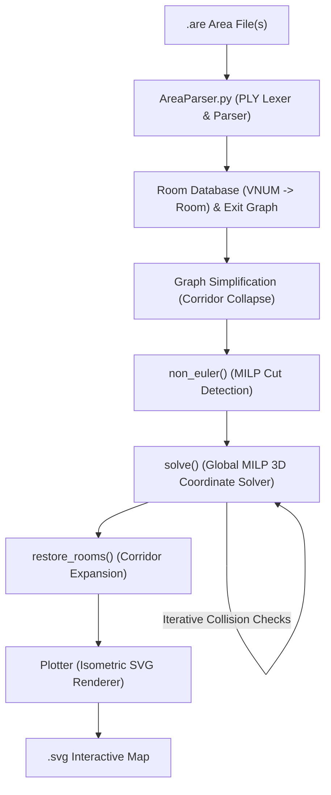

# ROMUtil Architecture & Design Guide

**ROMUtil** is an automated pipeline that parses text-based area files (`.are`) from **ROM (Rivers of MUD / DikuMUD)** codebases, calculates consistent 3D geometric coordinates `(x, y, z)` for rooms, resolves non-Euclidean contradictions and spatial collisions, and generates interactive isometric SVG map visualizations.

---

## 1. Problem Space & Challenges

In text-based MUDs, areas were authored manually by human builders over decades. Unlike tile-based maps, MUD areas are arbitrary directed graphs with cardinal exits:
- **Non-Euclidean Topologies**: Moving East and then West does not guarantee you return to the same room. Loops may have unequal opposing path lengths (e.g., 3 rooms North, 2 rooms East, 2 rooms South, 2 rooms West).
- **Corridors & Mazes**: Long straight hallways cause high solver complexity, while mazes contain deliberate cycles and one-way drops.
- **Verticality (Z-Axis)**: Areas have multiple elevation levels connected by `Up` and `Down` exits.
- **Zone Boundaries**: Exits often point to rooms outside the file (`VNUM`s not in the area) or unresolved destinations (`dst == -1`).

ROMUtil solves this layout challenge by combining **graph algorithms** with **Mixed-Integer Linear Programming (MILP)** via Coin-OR CBC and Pyomo.

---

## 2. System Architecture & Pipeline



The pipeline executes in five distinct phases:
1. **Lexing & Parsing**: Reads `.are` files into structured Python objects.
2. **Corridor Reduction**: Collapses straight hallways to reduce graph size.
3. **Eulerian / Cut Optimization**: Detects geometric inconsistencies and marks minimal exit cuts.
4. **Iterative MILP Placement**: Assigns integer coordinates `(x, y, z)` while lazily preventing exit line collisions.
5. **Restoration & Isometric Plotting**: Re-expands hallways and renders an SVG with interactive mouseover popups.

---

## 3. Component Deep Dive

### 3.1. Parsing Engine — [`AreaParser.py`](file:///home/user/proj/ROMUtil/AreaParser.py)

Built with Python PLY (`ply.lex` and `ply.yacc`):

- **[`Lexer`](file:///home/user/proj/ROMUtil/AreaParser.py#L11-L195)**:
  - Uses exclusive lexer states (`INITIAL`, `string`, `line`, `optional`) to handle the idiosyncratic ROM format.
  - Switches to `string` mode to extract multiline text terminated by tildes (`~`).
  - Recognizes keywords (`#AREA`, `#ROOMS`, `#MOBILES`, `#OBJECTS`, `#RESETS`, `#SHOPS`, `#SPECIALS`, `#HELPS`, `#SOCIALS`).
- **[`Parser`](file:///home/user/proj/ROMUtil/AreaParser.py#L196-L410)**:
  - An LALR(1) grammar that extracts rooms (`VNUM`, title, description) and doors/exits (`direction_number`, `dst_vnum`).
  - Implements grammar tolerance for non-room sections (`#SOCIALS`, `#HELPS`, etc.) so arbitrary MUD files parse without syntax errors.

---

### 3.2. Domain Models — [`Mapper.py`](file:///home/user/proj/ROMUtil/Mapper.py)

- **[`Direction`](file:///home/user/proj/ROMUtil/Mapper.py#L24-L34)**:
  An `IntEnum` representing 6 degrees of movement:
  - `0`: North, `1`: East, `2`: Up, `3`: South, `4`: West, `5`: Down.
  - `Direction.invert()` computes opposing direction via `(dir + 3) % 6`.
- **[`Room`](file:///home/user/proj/ROMUtil/Mapper.py#L42-L59)**:
  Represents a room node holding `vnum`, `name`, `desc`, `exits`, integer coordinates `(x, y, z)`, and a `fixups` list for collapsed corridors.
- **[`Exit`](file:///home/user/proj/ROMUtil/Mapper.py#L60-L85)**:
  Represents a directional edge between `src` and `dst`. Defines bidirectional equality (`__eq__`) and hash symmetry so opposite exits (`A -> B East` and `B -> A West`) map to the same logical edge.

---

### 3.3. Graph Simplification — [`graph()`](file:///home/user/proj/ROMUtil/Mapper.py#L467-L531)

Before invoking the mathematical solver, the graph is simplified to minimize variables:

1. **Hallway Condensation**:
   Rooms with exactly two opposite exits (e.g., East and West) are straight corridors. `graph()` trims the intermediate room, updates the neighbor exits to span the combined distance, and registers the collapsed room in `parent.fixups`.
2. **External & Unresolved Exit Handling**:
   - Exits pointing to `-1` (incomplete rooms) are assigned a synthetic VNUM `max(rdb.keys()) + 1`.
   - Exits leading outside the area file create lightweight `dummy` rooms (`room.dummy = True`) so boundaries can still be routed without crashing.
3. **Connected Components**:
   Uses `networkx.connected_components()` to split disconnected areas into independent subgraphs, solving and plotting each component separately.

---

### 3.4. Mathematical Layout Optimization — [`solve()`](file:///home/user/proj/ROMUtil/Mapper.py#L285-L466)

The layout is formulated as a Mixed-Integer Linear Program (MILP) using **Pyomo** and solved with the **Coin-OR CBC** solver:

#### Variables:
- `m.x[r]`, `m.y[r]`, `m.z[r]`: Integer coordinates for each room `r`.
- `m.cut[e]`: Binary variable indicating if an exit `e` is "cut" (relaxed from geometric constraints).
- `m.l_max[e]`: Positive integer measuring the maximum rendered length of exit `e`.
- `m.one_ways`: Variables bounding Manhattan distance between one-way endpoints.

#### Constraints:
1. **Relative Distance Constraints**:
   For an exit from room $u$ to room $v$ in direction East:
   $$x_v - x_u + M \cdot \text{cut}_e \ge l_{\min}(e)$$
   $$x_v - x_u - M \cdot \text{cut}_e \le l_{\max}(e)$$
   *(where $M$ is a big-M upper bound equal to the sum of all exit lengths).*
2. **Axis Alignment**:
   Non-cardinal axes are constrained to match (e.g., East exits enforce $y_u = y_v$ and $z_u = z_v$ unless cut).
3. **Cut Relaxation**:
   If an area contains contradictory cycles (e.g., a maze or non-Euclidean loop), `cut[e] = 1` disables the strict geometric distance requirement for that edge.

#### Objective Function:
$$\min \left( M^2 \sum \text{cut}_e + \sum l_{\max}(e) + \sum \text{dist}_{\text{one-way}} \right)$$
- Heavy penalty ($M^2$) prevents cutting exits unless mathematically unavoidable.
- Minimizes overall exit lengths to keep rooms compact.
- Keeps one-way endpoints clustered near each other.

#### Lazy Collision Avoidance:
To avoid adding $O(E^2)$ crossing constraints up front:
1. The solver finds an initial coordinate assignment.
2. An overlap detector scans pairs of non-incident exits using bounding-box checks.
3. When two exit lines intersect, disjunctive spatial separation constraints are added using binary relation variables (`relation[Direction]`):
   $$\sum_{d} \text{relation}_d \ge 1$$
4. The solver iterates until no crossings remain or constraints converge.

---

### 3.5. Reconstruction & Rendering — [`Plotter`](file:///home/user/proj/ROMUtil/Mapper.py#L86-L177)

1. **[`restore_rooms()`](file:///home/user/proj/ROMUtil/Mapper.py#L178-L190)**:
   Traverses `fixups` on surviving rooms and calculates exact coordinates for previously collapsed corridor rooms.
2. **Isometric Projection**:
   Converts 3D coordinates $(x, y, z)$ into 2D SVG canvas points using an oblique lift factor ($\text{lift} = 0.15$):
   $$X' = 2 + x + \text{lift} \cdot z$$
   $$Y' = 2 + \text{lift} \cdot z_{\max} + (y_{\max} - y) - \text{lift} \cdot z$$
3. **SVG Generation (`svgwrite`)**:
   - Rooms are drawn as boxes color-coded by elevation (Z-axis).
   - Bidirectional exits are drawn as black lines; one-way exits as red lines.
   - External exits are rendered as stub arrows pointing off-map.
   - Interactive `<set>` triggers display floating tooltips on mouseover showing room names, full descriptions, and exit directions.

---

## 4. Testing & Development Workflow

The codebase uses **`uv`**, **`pytest`**, and **`pre-commit`**:

### Running Tests
```bash
uv run pytest -v
```
To run tests with a full terminal coverage report:
```bash
uv run pytest --cov=AreaParser --cov=Mapper --cov-report=term-missing
```

### Updating Dependencies
To upgrade all direct and indirect dependencies in `uv.lock` and run verification:
```bash
make update-deps
```

### Pre-commit Hooks
Pre-commit hooks are installed in `.git/hooks/pre-commit`. On every `git commit`, the hook:
- Strips trailing whitespace and fixes EOF markers.
- Runs `uv run pytest` to ensure all 44 tests pass before permitting the commit.
