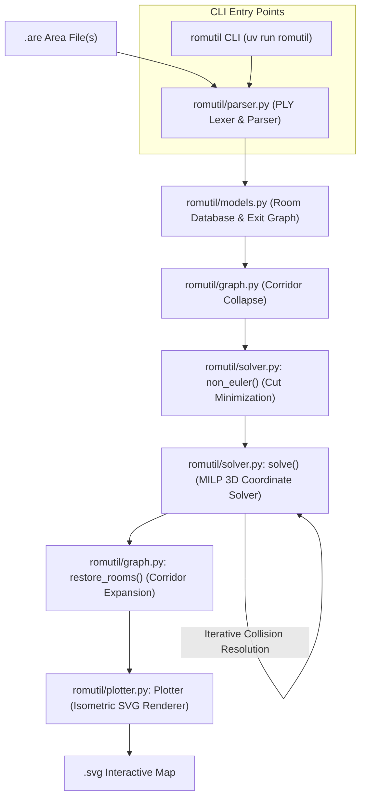

# ROMUtil Architecture & Design Guide

**ROMUtil** is an automated pipeline that parses text-based area files (`.are`) from **ROM (Rivers of MUD / DikuMUD)** codebases, calculates consistent 3D geometric coordinates `(x, y, z)` for rooms, resolves non-Euclidean contradictions and spatial collisions, and generates interactive isometric SVG map visualizations.

---

## 1. Problem Space & Challenges

In text-based MUDs, areas were authored manually by human builders over decades. Unlike tile-based maps, MUD areas are arbitrary directed graphs with cardinal exits:
- **Non-Euclidean Topologies**: Moving East and then West does not guarantee you return to the same room. Loops may have unequal opposing path lengths (e.g., 3 rooms North, 2 rooms East, 2 rooms South, 2 rooms West).
- **Corridors & Mazes**: Long straight hallways cause high solver complexity, while mazes contain deliberate cycles and one-way drops.
- **Verticality (Z-Axis)**: Areas have multiple elevation levels connected by `Up` and `Down` exits.
- **Zone Boundaries**: Exits often point to rooms outside the file (`VNUM`s not in the area) or unresolved destinations (`dst == -1`).

ROMUtil solves this layout challenge by combining **graph algorithms** with **Mixed-Integer Linear Programming (MILP)** via Coin-OR CBC and Pyomo.

---

## 2. System Architecture & Pipeline

The project is structured as a modular Python package ([`romutil/`](file:///home/user/proj/ROMUtil/romutil)) with a unified console CLI entry point:



The pipeline executes in five distinct phases:
1. **Lexing & Parsing**: Reads `.are` files with Latin-1 fallback into structured Python objects.
2. **Corridor Reduction**: Collapses straight hallways to reduce graph and solver complexity.
3. **Eulerian / Cut Optimization**: Detects geometric inconsistencies and marks minimal exit cuts.
4. **Iterative MILP Placement**: Assigns integer coordinates `(x, y, z)` while lazily preventing exit line collisions.
5. **Restoration & Isometric Plotting**: Re-expands hallways and renders an SVG with interactive mouseover popups.

---

## 3. Package & Module Structure

```text
ROMUtil/
├── romutil/                     # Core Python package
│   ├── __init__.py              # Package public API exports
│   ├── cli.py                   # Modernized CLI (pathlib.Path) & entry point
│   ├── graph.py                 # Corridor collapsing, restoration, and mfas
│   ├── models.py                # Direction, Room, and Exit domain models
│   ├── parser.py                # PLY Lexer & LALR Parser with resilient encoding
│   ├── plotter.py               # Oblique isometric SVG rendering engine
│   └── solver.py                # Pyomo MILP optimization and overlap detection
├── pyproject.toml               # PEP 621 package metadata & script definitions
├── uv.lock                      # Pinned dependency lockfile managed by uv
└── tests/                       # Comprehensive pytest suite (46 tests, 96% coverage)
```

---

## 4. Component Deep Dive

### 4.1. Parsing Engine — [`romutil/parser.py`](file:///home/user/proj/ROMUtil/romutil/parser.py)

Built with Python PLY (`ply.lex` and `ply.yacc`):

- **[`Lexer`](file:///home/user/proj/ROMUtil/romutil/parser.py#L9-L217)**:
  - Uses exclusive lexer states (`INITIAL`, `string`, `line`, `optional`) to handle the idiosyncratic ROM format.
  - Switches to `string` mode to extract multiline text terminated by tildes (`~`).
  - Recognizes keywords (`#AREA`, `#ROOMS`, `#MOBILES`, `#OBJECTS`, `#RESETS`, `#SHOPS`, `#SPECIALS`, `#HELPS`, `#SOCIALS`).
- **[`Parser`](file:///home/user/proj/ROMUtil/romutil/parser.py#L230-L464)**:
  - An LALR(1) grammar producing strongly-typed AST dataclasses (`AreaData`, `RoomDef`, `ExitDef`, etc.) instead of raw nested tuples.
  - Implements grammar tolerance for non-room sections (`#SOCIALS`, `#HELPS`, etc.) so arbitrary MUD files parse without syntax errors.
  - Opens files using `encoding="latin-1", errors="replace"` to support vintage MUD files containing non-UTF-8 bytes.
  - Disables disk table writing (`write_tables=False`) by default to run safely in read-only environments.

---

### 4.2. Domain Models & AST Dataclasses — [`romutil/models.py`](file:///home/user/proj/ROMUtil/romutil/models.py)

#### 4.2.1. Strongly-Typed AST Dataclasses
Modern immutable `@dataclass(frozen=True)` definitions replacing raw tuple returns from the parser:
- **`AreaHeader`**: Stores area metadata (`filename`, `name`, `builder`, `vnum_min`, `vnum_max`).
- **`ExitDef`**: Defines parsed doors/exits (`direction`, `dst_vnum`, `description`, `keyword`, `key_vnum`, `flags`).
- **`ExtraDescr`**: Holds extra descriptions (`keyword`, `description`).
- **`RoomDef`**: Defines room structures (`vnum`, `name`, `description`, `room_flags`, `sector`, `exits`, `extras`).
- **`MobileDef`**: Defines mobile entities (`vnum`, `player_name`, `short_desc`, `long_desc`, `desc`, `race`, attributes, combat parameters).
- **`ObjectDef`**: Defines items and equipment (`vnum`, `name`, `short_desc`, `desc`, `material`, `item_type`, `extra_flags`, `wear_flags`, `values`, `level`, `weight`, `cost`, `condition`).
- **`ResetDef`**, **`ShopDef`**, **`SpecialDef`**, **`HelpDef`**, **`SocialDef`**: Typed representations for resets, merchant shops, mob special functions, help entries, and social commands.
- **`AreaData`**: Top-level container aggregating all parsed sections (`header`, `rooms`, `mobiles`, `objects`, `resets`, `shops`, `specials`, `helps`, `socials`), with section dictionary and index backward-compatibility.

#### 4.2.2. Graph & Solver Domain Models
- **[`Direction`](file:///home/user/proj/ROMUtil/romutil/models.py#L10-L21)**:
  An `IntEnum` representing 6 degrees of movement:
  - `0`: North, `1`: East, `2`: Up, `3`: South, `4`: West, `5`: Down.
  - `Direction.invert()` computes opposing direction via `(dir + 3) % 6`.
- **[`Room`](file:///home/user/proj/ROMUtil/romutil/models.py#L328-L365)**:
  Represents a mutable room node holding `vnum`, `name`, `desc`, `exits`, integer coordinates `(x, y, z)`, and a `fixups` list for collapsed corridors. Accepts either typed `RoomDef` instances or legacy tuples.
- **[`Exit`](file:///home/user/proj/ROMUtil/romutil/models.py#L288-L326)**:
  Represents a directional edge between `src` and `dst`. Defines bidirectional equality (`__eq__`) and hash symmetry so opposite exits (`A -> B East` and `B -> A West`) map to the same logical edge. Accepts either typed `ExitDef` instances or legacy tuples.

---

### 4.3. Graph Simplification — [`romutil/graph.py`](file:///home/user/proj/ROMUtil/romutil/graph.py)

Before invoking the mathematical solver, the graph is simplified to minimize variables:

1. **Hallway Condensation**:
   Rooms with exactly two opposite exits (e.g., East and West) are straight corridors. `graph()` trims the intermediate room, updates neighbor exits to span the combined distance, and registers the collapsed room in `parent.fixups`.
2. **External & Unresolved Exit Handling**:
   - Exits pointing to `-1` (incomplete rooms) are assigned a synthetic VNUM `max(rdb.keys()) + 1`.
   - Exits leading outside the area file create lightweight `dummy` rooms (`room.dummy = True`) so boundaries can still be routed without crashing.
3. **Connected Components**:
   Uses `networkx.connected_components()` to split disconnected areas into independent subgraphs, solving and plotting each component separately.

---

### 4.4. Mathematical Layout Optimization — [`romutil/solver.py`](file:///home/user/proj/ROMUtil/romutil/solver.py)

The layout is formulated as a Mixed-Integer Linear Program (MILP) using **Pyomo** and solved with the **Coin-OR CBC** solver:

#### Variables:
- `m.x[r]`, `m.y[r]`, `m.z[r]`: Integer coordinates for each room `r`.
- `m.cut[e]`: Binary variable indicating if an exit `e` is "cut" (relaxed from geometric constraints).
- `m.l_max[e]`: Positive integer measuring the maximum rendered length of exit `e`.
- `m.one_ways`: Variables bounding Manhattan distance between one-way endpoints.

#### Constraints:
1. **Relative Distance Constraints**:
   For an exit from room $u$ to room $v$ in direction East:
   $$x_v - x_u + M \cdot \text{cut}_e \ge l_{\min}(e)$$
   $$x_v - x_u - M \cdot \text{cut}_e \le l_{\max}(e)$$
   *(where $M$ is a big-M upper bound equal to the sum of all exit lengths).*
2. **Axis Alignment**:
   Non-cardinal axes are constrained to match (e.g., East exits enforce $y_u = y_v$ and $z_u = z_v$ unless cut).
3. **Cut Relaxation**:
   If an area contains contradictory cycles (e.g., a maze or non-Euclidean loop), `cut[e] = 1` disables the strict geometric distance requirement for that edge.

#### Objective Function:
$$\min \left( M^2 \sum \text{cut}_e + \sum l_{\max}(e) + \sum \text{dist}_{\text{one-way}} \right)$$
- Heavy penalty ($M^2$) prevents cutting exits unless mathematically unavoidable.
- Minimizes overall exit lengths to keep rooms compact.
- Keeps one-way endpoints clustered near each other.

#### Lazy Collision Avoidance:
To avoid adding $O(E^2)$ crossing constraints up front:
1. The solver finds an initial coordinate assignment.
2. An overlap detector scans pairs of non-incident exits using bounding-box checks with `tqdm` progress tracking.
3. When two exit lines intersect, disjunctive spatial separation constraints are added using binary relation variables (`relation[Direction]`):
   $$\sum_{d} \text{relation}_d \ge 1$$
4. Generates an intermediate `progress.svg` snapshot after each solver iteration.
5. The solver iterates until no crossings remain or constraints converge.

---

### 4.5. Reconstruction & Rendering — [`romutil/plotter.py`](file:///home/user/proj/ROMUtil/romutil/plotter.py)

1. **[`restore_rooms()`](file:///home/user/proj/ROMUtil/romutil/graph.py#L12-L29)**:
   Traverses `fixups` on surviving rooms and calculates exact coordinates for previously collapsed corridor rooms.
2. **Isometric Projection**:
   Converts 3D coordinates $(x, y, z)$ into 2D SVG canvas points using an oblique lift factor ($\text{lift} = 0.15$):
   $$X' = 2 + x + \text{lift} \cdot z$$
   $$Y' = 2 + \text{lift} \cdot z_{\max} + (y_{\max} - y) - \text{lift} \cdot z$$
3. **SVG Generation (`svgwrite`) & Multi-Layer Elevation**:
   - **Elevation Grouping**: Elements are grouped by Z-coordinate into `<g id="elevation-{z}" class="elevation-layer" data-z="{z}">` tags for every unique elevation plane.
   - **Interactive Layer Controls**: Embedded `<style>` and JavaScript within the SVG `<defs>` provide clickable toggle buttons (`<g id="elevation-controls">`) with visual active/inactive states allowing users to toggle individual floor levels on/off to prevent vertical visual occlusion.
   - **Dynamic HSL Color Palette**: Replaced static 7-color array with dynamic HSL color gradient (`hsl(hue, 75%, 50%)`) supporting arbitrary elevation depths ($Z \ge 10$) without clamping or `IndexError`.
   - Bidirectional exits are drawn as black lines; one-way exits as red lines.
   - External exits are rendered as stub arrows pointing off-map.
   - Interactive `<set>` triggers display floating tooltips on mouseover showing room names, full descriptions, and exit directions.

---

### 4.6. CLI & Execution — [`romutil/cli.py`](file:///home/user/proj/ROMUtil/romutil/cli.py)

- Uses modern `pathlib.Path` argument parsing (avoiding Python 3.14 deprecation warnings).
- Registered as a project console script (`[project.scripts] romutil = "romutil.cli:cli"`).
- Supports `--split-levels` to export separate SVGs for each distinct elevation plane (e.g. `<outbase>_z{z}.svg`).
- Usage:
  ```bash
  uv run romutil <area.are> [-outbase <name>] [--split-levels] [-d]
  ```

---

## 5. Testing & Development Workflow

The codebase uses **`uv`**, **`pytest`**, and **`pre-commit`**:

### Running Tests
```bash
uv run pytest -v
```
To run tests with a full terminal coverage report:
```bash
uv run pytest --cov=romutil --cov-report=term-missing
```

### Updating Dependencies
To upgrade all direct and indirect dependencies in `uv.lock` and run verification:
```bash
make update-deps
```

### Pre-commit Hooks
Pre-commit hooks are installed in `.git/hooks/pre-commit`. On every `git commit`, the hook:
- Strips trailing whitespace and fixes EOF markers.
- Validates YAML configs and blocks large files.
- Runs `uv run pytest` to ensure all 46 tests pass before permitting the commit.
