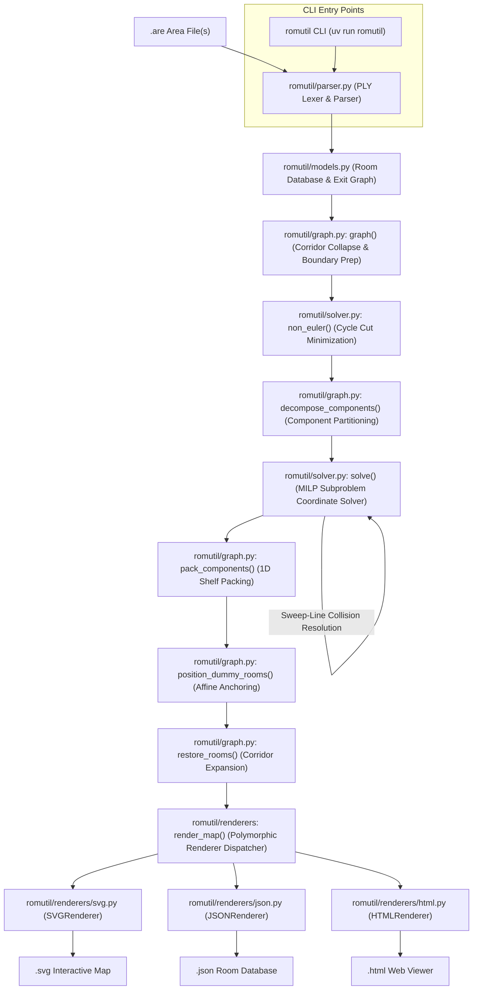

# ROMUtil Architecture & Design Guide

**ROMUtil** is an automated pipeline that parses text-based area files (`.are`) from **ROM (Rivers of MUD / DikuMUD)** codebases, calculates consistent 3D geometric coordinates `(x, y, z)` for rooms, resolves non-Euclidean contradictions and spatial collisions, and generates interactive isometric SVG map visualizations.

---

## 1. Problem Space & Challenges

In text-based MUDs, areas were authored manually by human builders over decades. Unlike tile-based maps, MUD areas are arbitrary directed graphs with cardinal exits:
- **Non-Euclidean Topologies**: Moving East and then West does not guarantee you return to the same room. Loops may have unequal opposing path lengths (e.g., 3 rooms North, 2 rooms East, 2 rooms South, 2 rooms West).
- **Corridors & Mazes**: Long straight hallways cause high solver complexity, while mazes contain deliberate cycles and one-way drops.
- **Verticality (Z-Axis)**: Areas have multiple elevation levels connected by `Up` and `Down` exits.
- **Zone Boundaries**: Exits often point to rooms outside the file (`VNUM`s not in the area) or unresolved destinations (`dst == -1`).

ROMUtil solves this layout challenge by combining **graph algorithms** with **Mixed-Integer Linear Programming (MILP)** via Coin-OR CBC and Pyomo.

---

## 2. System Architecture & Pipeline

The project is structured as a modular Python package ([`romutil/`](../romutil)) with a unified console CLI entry point:



The pipeline executes in six distinct phases:
1. **Lexing & Parsing**: Ingests `.are` and `.wld` files across MUD dialect grammars with resilient bitmask evaluation and encoding fallback into strongly-typed AST records (`AreaData`).
2. **Topological Reduction & Cycle Relaxation**: Collapses straight corridors, prepares boundary dummy structures, and marks minimal exit cuts for contradictory non-Euclidean cycles via Eulerian optimization (`non_euler`).
3. **Connected Component Decomposition**: Partitions disconnected topological graphs into isolated weakly connected subgraphs $\{C_1, \dots, C_k\}$ to divide the combinatorial decision space.
4. **Iterative MILP Subproblem Placement**: Computes integer coordinates per component using dimension-specific Big-$M$ bounds, planar separation reduction, and event-driven sweep-line spatial collision detection.
5. **Spatial Assembly & Restoration**: Normalizes component subproblem coordinates, applies non-overlapping 1D horizontal shelf packing, affinely positions external boundary dummy rooms, and re-expands collapsed hallway nodes.
6. **Polymorphic Rendering**: Dispatches the assembled, fully-positioned room database to vector graphics (SVG), structured data (JSON), or a standalone interactive web application (HTML/JS) via the unified renderer architecture.

---

## 3. Package & Module Structure

```text
ROMUtil/
├── docs/                        # Architectural guides & format documentation
│   ├── DESIGN.md                # Evergreen system architecture and design guide
│   └── MUD_REPOSITORIES.md      # Public MUD area repository catalog & dialect specs
├── romutil/                     # Core Python package
│   ├── __init__.py              # Package public API exports
│   ├── cli.py                   # Unified CLI entry point & multi-format options
│   ├── graph.py                 # Corridor collapsing, restoration, and mfas
│   ├── models.py                # Direction, Room, and Exit domain models
│   ├── parser.py                # PLY Lexer & LALR Parser with resilient encoding
│   ├── renderers/               # Unified map renderer architecture
│   │   ├── __init__.py          # RENDERERS registry, get_renderer, and render_map
│   │   ├── base.py              # BaseRenderer protocol definition
│   │   ├── html.py              # Standalone interactive HTML/JS map viewer renderer
│   │   ├── json.py              # Structured JSON map data renderer & serializer
│   │   └── svg.py               # Oblique isometric SVG vector map renderer
│   ├── solver.py                # Pyomo MILP optimization and overlap detection
│   └── templates/               # Embedded web application templates
│       ├── __init__.py
│       └── viewer.html          # Self-contained HTML/JS map viewer asset
├── pyproject.toml               # PEP 621 package metadata & script definitions
├── uv.lock                      # Pinned dependency lockfile managed by uv
└── tests/                       # Comprehensive unit and integration test suite
```

---

## 4. Component Architecture

### 4.1. Parsing Engine — [`romutil/parser.py`](../romutil/parser.py)

The parsing engine ingests text-based MUD area files across historical and modern DikuMUD derivative dialects (ROM 2.4, Merc 2.1/2.2, Envy 1.0/2.0, CircleMUD / DikuMUD III, DikuMUD Alfa / Gamma, ACK!MUD / AckFUSS, and ANATOLIA 3.0) and constructs structured in-memory area representations using Python PLY (`ply.lex` and `ply.yacc`).

- **DikuMUD Alfa / Gamma Monolithic Ingestion & VNUM 0 ("The Void") Architecture**:
  - Ingests monolithic `.wld` files (such as `tinyworld.wld`) containing unpartitioned room definitions across multiple zones without `#AREA` metadata headers or `#ROOMS` section boundaries.
  - Accommodates Diku Alfa's 3-parameter room definition lines (`<zone_number> <room_flags> <sector_type>`) and normalizes trailing EOF sentinels (`#99999\n$~`, `#0\n$~`, `$~`, `$\n`).
  - Resolves semantic overloading of VNUM `0` ("The Void"): in DikuMUD Alfa, room `#0` is a valid, traversable room with cardinal exits, while in ROM/Merc derivations `#0` functions as a section terminator sentinel. The lexer utilizes contextual lookahead in `t_NULL`: when `#0` is immediately followed by a tilde-terminated room title string, it emits `VNUM(0)` to enter `p_room`; when followed by section boundaries or EOF, it emits `NULL` to close `p_sections` without LALR(1) shift/reduce conflicts.
  - Generates synthesized `AreaHeader` metadata when standalone or monolithic `.wld` files are processed by the CLI or plotting pipelines, determining bounding intervals $[V_{\min}, V_{\max}]$ from parsed rooms and deriving human-readable area names from filename stems.
  - Domain abstractions (`RoomDef`, `Room`, `Exit`) and MILP solver formulations treat node `0` and edges to destination `0` symmetrically with non-zero nodes, supporting full vertical layering and reciprocal one-way exit resolution.
- **ACK!MUD / AckFUSS Tagged Headers & Colour Markup Sanitization**:
  - Ingests ACK!MUD 4.3 and AckFUSS area definitions featuring single-character tagged line headers (`Q`, `K`, `L`, `N`, `I`, `V`, `X`, `F`, `U`, `O`, `R`, `W`, `M`) under `#AREA` or `#AREADATA`.
  - Normalizes tagged `#AREA` records into canonical 4-line metadata blocks (`filename`, `name`, `builder`, `vnum_min vnum_max`), extracting area titles (`K <name>~`), VNUM bounding intervals (`V <min> <max>`), and authors/builders (`O <builder>~` with fallback to `L <levels>~`).
  - Preprocesses text buffers via `sanitize_ackmud_colour` to strip ACK!MUD ANSI colour escape sequences (`@@<char>`, e.g. `@@y`, `@@b`, `@@R`, `@@N`, `@@W`, `@@d`) while expanding escaped `@` sequences (`@@@` $\to$ `@`).
  - Preserves monospace spacing, line breaks, and ASCII art room layouts across titles and multiline room descriptions, yielding clean plain-text strings for rendering in SVG, HTML, and JSON without visual artifacts or markup leakage.
- **ANATOLIA 3.0 Custom Section Tolerance (`#RESETMESSAGE`, `#FLAG`)**:
  - Ingests ANATOLIA 3.0 top-level area file sections, including tilde-terminated `#RESETMESSAGE <text>~` (and multiline `#RESETMESSAGE\n<text>~`) and area flag declarations (`#FLAG <flags>` or `#FLAG\n<flags>`) containing alphanumeric identifiers, words, or numeric bitvectors.
  - Normalizes section boundaries within `normalize_dialect_buffer` to enforce canonical delimiter spacing without interfering with subsequent room blocks (`#ROOMS`) or resets (`#RESETS`).
  - PLY reductions in `Parser` map `#RESETMESSAGE` and `#FLAG` AST nodes into `reset_message` and `flag` attributes on the `AreaData` domain model, exposing them through standard dictionary keys (`area["#RESETMESSAGE"]`, `area["#FLAG"]`) and sequence iteration while maintaining full backward compatibility with standard ROM 2.4 and Merc-derived formats.
- **Dialect Normalization Layer (`normalize_dialect_buffer`)**:
  - Preprocesses input text buffers prior to lexical analysis to ensure deterministic state transitions in PLY's LALR(1) state machine without lookahead ambiguity.
  - Converts Envy `#AREADATA ... End` key-value blocks, ACK!MUD tagged `#AREA` blocks, and Merc single-line `#AREA { ... } ...~` headers into canonical 4-line `#AREA` metadata.
  - Evaluates piped bitmask expressions (e.g. `4|8|1024` evaluates to composite integer `1036`) while preserving alpha string flags.
  - Strips unsupported dialect-specific sections (`#GAMES`, `#CLANS`, `#ECONOMY`, `#OLC`).
  - Standardizes CircleMUD / DikuMUD EOF delimiters (`$~` and `$`) into standard `#$` markers.
- **Split-World Directory Loader (`parse_circlemud_directory`)**:
  - Ingests split-file CircleMUD 3.x and tbaMUD world hierarchies where rooms and zones are decoupled across dedicated files (`*.wld` room records, `*.zon` reset and zone headers).
  - Directory resolution supports flat folder structures (`30.wld`, `30.zon`), canonical hierarchical `lib/world/` layouts (`wld/` and `zon/` subdirectories), and explicit `index` manifest files listing active zone numbers.
  - Zone metadata parsing (`parse_circlemud_zone_file`) decodes `.zon` headers (zone virtual number, zone name, author/builder, top and bottom room boundaries, lifespan, and reset modes) as well as reset commands (`M`, `O`, `G`, `E`, `P`, `D`, `R`, `V`).
  - Zone binding matches rooms to zone headers by filename stem correspondence, falling back to dynamic VNUM interval containment ($V_{\min} \le \text{vnum}(r) \le V_{\max}$). When zone files are omitted, fallback headers are synthesized from room bounds.
  - Merges parsed rooms across all `.wld` files and zone resets into a unified `AreaData` domain model for seamless downstream layout solving.
- **[`Lexer`](../romutil/parser.py)**:
  - Employs dedicated lexer states (`INITIAL`, `string`, `line`, `optional`) to parse mixed-format data.
  - Recognizes tilde-terminated multiline text strings (`~`), cardinal door tokens (`D0` through `D5`), and canonical or dialect section aliases (`#ROOMDATA`, `#MOBDATA`, `#NEWOBJECTS`, `#OBJECTDATA`).
- **[`Parser`](../romutil/parser.py)**:
  - An LALR(1) grammar that extracts room topology (VNUMs, titles, descriptions, flags, sector types) and directional exits (destination VNUMs, door keywords, lock flags).
  - Accommodates variable room parameters (including CircleMUD's 6-field room lines) and variable door parameter definitions (handling 1 to 5 numeric values for legacy Merc reverse pointers).
  - Intersperses comment handling (`*`) across `#RESETS` and `#SPECIALS` blocks and tolerates non-spatial sections (`#SHOPS`, `#MOBILES`, `#HELPS`, `#SOCIALS`).
  - Reads files using `latin-1` decoding with replacement fallback to handle vintage MUD files containing non-UTF-8 character data.
- **Dialect Specifications & Repository Catalog**:
  - Comprehensive format specifications, grammar variants across MUD lineages (ROM, Merc, Envy, DikuMUD, CircleMUD, SMAUG, ANATOLIA, ACK!MUD), and verified upstream GitHub repositories are cataloged in [`docs/MUD_REPOSITORIES.md`](./MUD_REPOSITORIES.md).

---

### 4.2. Domain Models & Graph Representation — [`romutil/models.py`](../romutil/models.py)

The domain models define the spatial and topological primitives used throughout the graph layout and rendering pipeline:

- **[`Direction`](../romutil/models.py)**:
  An enumeration representing the 10 degrees of spatial movement across cardinal (`North`, `East`, `South`, `West`), vertical (`Up`, `Down`), and intercardinal diagonal (`Northeast`, `Northwest`, `Southeast`, `Southwest`) vectors.
  - Defines opposing directional symmetry via `invert()` mapping each cardinal, vertical, and intercardinal direction to its spatial inverse (`North` <-> `South`, `East` <-> `West`, `Up` <-> `Down`, `Northeast` <-> `Southwest`, `Northwest` <-> `Southeast`).
- **[`Exit`](../romutil/models.py)**:
  Represents a directed spatial edge between `src` and `dst` with an associated direction and distance span.
  - Implements symmetrical equality (`__eq__`) and hash invariance so opposing exits (`A -> B East` and `B -> A West`) map to the same logical edge.
  - Tracks whether an exit is strictly `one_way` (lacking a reciprocal return path).
- **[`Room`](../romutil/models.py)**:
  The mutable room node in the spatial graph. Stores integer coordinates `(x, y, z)`, connected exits, and a `fixups` queue of collapsed hallway nodes.
  - Flags synthetic boundary rooms (`room.dummy = True`) created for unresolved or out-of-area destinations.
- **[`AreaData`](../romutil/models.py)**:
  Top-level container holding strongly-typed AST definitions (`AreaHeader`, `RoomDef`, `ExitDef`, `ObjectDef`, `MobileDef`, `ResetDef`, `ShopDef`, `SpecialDef`, `HelpDef`, `SocialDef`, `ExtraDescr`, and optional ANATOLIA metadata `reset_message`, `flag`), guaranteeing type safety across pipeline stages.

---

### 4.3. Graph Simplification & Spatial Partitioning — [`romutil/graph.py`](../romutil/graph.py)

Before invoking the mathematical optimization engine, the area graph is simplified and partitioned to minimize combinatorial complexity:

1. **Hallway Condensation (`graph`)**:
   Rooms with in-degree/out-degree 2 and collinear opposing exits (e.g., East and West) form straight corridors. `graph()` trims intermediate rooms, links the boundary endpoints with a single aggregate edge spanning the combined distance, and registers collapsed room sequences into `parent.fixups`. This contracts the active vertex count by 30–60% on typical MUD topologies prior to MILP formulation.
2. **External Boundary Dummy Decoupling & Preparation (`graph`)**:
   - **Multi-Source External Exit Decoupling**: When multiple rooms in an area file feature exits leading to the same external target VNUM (e.g. `school.are` rooms 3700 and 3760 exiting to external room 3001), each exit is decoupled into a dedicated synthetic dummy stub instance (`room.dummy = True`) assigned unique synthetic negative VNUMs while preserving `target_vnum`. This prevents multi-source external exits from anchoring to a single shared spatial point and eliminates long diagonal cross-map edge stretching or zero-length collapse across the layout.
   - **Unresolved Exit Stubbing**: Exits pointing to unresolved destinations (`dst == -1`) receive dedicated synthetic dummy stubs (`room.dummy = True`).
   - Boundary dummy rooms are excluded from the Pyomo decision space, eliminating unconstrained floating variables during branch-and-cut exploration.
3. **Connected Component Decomposition (`decompose_components`)**:
   - **Partitioning**: Constructs an undirected topological graph $G = (V_{\text{core}}, E_{\text{core}})$ over non-dummy rooms and internal exits. Disconnected subgraphs are partitioned into $k$ independent weakly connected components $\{C_1, C_2, \dots, C_k\}$ using `networkx.connected_components()`.
   - **Combinatorial Space Decoupling**: If $k > 1$, each component $C_i$ forms an isolated MILP subproblem $(rdb_i, exits_i)$ along with its adjacent boundary dummy copies. The maximum decision variable count per MILP instance decreases from $3 \cdot |V_{\text{core}}|$ to $3 \cdot \max_i |V(C_i)|$, and cross-component candidate overlap pairs are completely eliminated ($0$ cross-component disjunctive constraints generated).
   - **Single-Component Pass-Through**: When $k = 1$, the direct monolithic solve path is preserved without subproblem decomposition or packing overhead.
4. **1D Shelf Bounding Box Packing (`pack_components`)**:
   - After independent solving of each component $C_i$, the component 3D bounding box $[x_{\min}^i, x_{\max}^i] \times [y_{\min}^i, y_{\max}^i] \times [z_{\min}^i, z_{\max}^i]$ is computed.
   - Each component is locally normalized to origin $(0, 0, 0)$ and placed along the X-axis via 1D horizontal shelf packing with configurable padding $\Delta_{\text{pad}} \ge 2$:
     $$X_{\text{offset}}^{(0)} = 0, \quad X_{\text{offset}}^{(i)} = X_{\text{offset}}^{(i-1)} + \text{width}(C_{i-1}) + \Delta_{\text{pad}}$$
   - Guarantees zero spatial overlap across all disconnected components and elevation levels in $O(k)$ time without requiring MILP disjunctive collision constraints.
5. **Spatial Candidate Exit Pair Precomputation**:
   Precomputes non-incident candidate exit pairs in a hash set to provide $O(1)$ candidate retrieval and retirement for downstream sweep-line spatial collision detection in [`romutil/solver.py`](../romutil/solver.py).
6. **External Dummy Room Positioning (`position_dummy_rooms`)**:
   Post-solve positioning anchors each boundary dummy room exactly 1 unit distance in the nominal exit direction from its primary source room:
   $$\mathbf{x}_{\text{dummy}} = \mathbf{x}_{\text{src}} + \mathbf{d}_{\text{exit}}$$
   Ensures consistent geometric placement for external exit stubs in SVG, JSON, and HTML renderers without solver overhead.
7. **Corridor Expansion & Coordinate Interpolation (`restore_rooms`)**:
   Traverses `fixups` on surviving rooms and calculates exact integer coordinates for collapsed corridor rooms via linear interpolation between corridor endpoints.
8. **Minimal Feedback Arc Set (`mfas`)**:
   Computes minimal feedback arc sets to identify directional cycle cuts and orient directed acyclic graph projections.

---

### 4.4. Mathematical Layout Optimization — [`romutil/solver.py`](../romutil/solver.py)

The layout is formulated as a Mixed-Integer Linear Program (MILP) using **Pyomo** and solved with the **Coin-OR CBC** solver:

#### Variables:
- `m.x[r]`, `m.y[r]`, `m.z[r]`: Integer coordinates for each non-dummy room $r \in m.\text{Rooms}$, tightly bounded in $[-M_x, M_x]$, $[-M_y, M_y]$, $[-M_z, M_z]$ (boundary dummy rooms are excluded from the decision space).
- `m.cut[e]`: Binary variable indicating if an exit $e$ is "cut" (relaxed from geometric constraints).
- `m.l_max[e]`: Positive integer measuring the maximum rendered length of exit $e$.
- `m.one_ways`: Variables bounding Manhattan distance between one-way endpoints, bounded in $[0, 2M]$.

#### Boundary Dummy Room Elimination & Affine Anchoring:
To eliminate unconstrained floating rooms in $[-M_x, M_x] \times [-M_y, M_y] \times [-M_z, M_z]$, boundary dummy rooms ($r \in \text{Rooms}_{\text{dummy}}$) are omitted from the Pyomo integer decision variables:
1. **Decision Space Reduction**:
   The room set $m.\text{Rooms}$ is strictly initialized with non-dummy rooms ($V_{\text{core}}$). For an area with $N_{\text{dummy}}$ external boundary rooms, this eliminates $3 \cdot N_{\text{dummy}}$ integer decision variables from the branch-and-cut tree (e.g., reducing `midgaard.are` decision variables from 393 to 324, an exact 17.557% reduction).
2. **Affine Spatial Anchoring**:
   For each boundary exit $e = (u, v)$ with source room $u \in V_{\text{core}}$ and dummy room $v \in V_{\text{dummy}}$, the dummy room coordinates are treated as affine linear expressions:
   $$\mathbf{x}_v = \mathbf{x}_u + \mathbf{d}_{\text{exit}}(e)$$
   where $\mathbf{d}_{\text{exit}}(e)$ represents the displacement vector in the nominal exit direction (cardinal, vertical, or intercardinal diagonal $(\pm 1, \pm 1, 0)$).
   When secondary one-way exits connect back to a dummy room (e.g. exit $w \to v$), one-way distance constraints substitute the affine expression $\mathbf{x}_u + \mathbf{d}_{\text{exit}}(e)$ directly in place of $\mathbf{x}_v$, preserving multi-floor vertical separation without instantiating integer variables.
3. **Deterministic Post-Solve Positioning**:
   Following optimization and hallway corridor restoration, `position_dummy_rooms(rdb, exits)` anchors each dummy room exactly 1 unit distance in the nominal exit direction from its primary source room, ensuring consistent geometric placement for external exit stubs in SVG, JSON, and HTML renderers.
4. **Disjunctive Dummy Stub Collision Avoidance**:
   Because boundary dummy rooms are omitted from $m.\text{Rooms}$ and represented as affine linear expressions $\mathbf{x}_{\text{dummy}} = \mathbf{x}_s + \mathbf{d}_{\text{exit}}$, core rooms could theoretically occupy identical spatial coordinates to an adjacent dummy stub if unconstrained. During iterative collision detection, room-to-dummy point collisions ($\mathbf{x}_v = \mathbf{x}_s + \mathbf{d}$) are identified and resolved by generating disjunctive Big-M separation constraints:
   $$x_v - x_s \ge 1 + dx - M_{\text{sep}} (1 - \text{relation}_x)$$
   $$x_s - x_v \ge 1 - dx - M_{\text{sep}} (1 - \text{relation}_{-x})$$
   $$y_v - y_s \ge 1 + dy - M_{\text{sep}} (1 - \text{relation}_y)$$
   $$y_s - y_v \ge 1 - dy - M_{\text{sep}} (1 - \text{relation}_{-y})$$
   $$z_v - z_s \ge 1 + dz - M_{\text{sep}} (1 - \text{relation}_z)$$
   $$z_s - z_v \ge 1 - dz - M_{\text{sep}} (1 - \text{relation}_{-z})$$
   $$\sum_{d \in \mathcal{D}_{\text{active}}} \text{relation}_d \ge 1, \quad \text{relation}_d \in \{0, 1\}$$
   where safe bounds $M_{\text{sep}} = 2 M_d + 4$ prevent infeasibility and guarantee zero spatial collisions between core rooms and dummy stubs without introducing integer decision variables for the dummy stubs.
5. **Disjunctive Core Room Point Collision Avoidance**:
   In layouts containing parallel topological paths, converging exit funnels, or disconnected graph components, distinct core rooms $u, v \in V_{\text{core}}$ ($u < v$) can occupy identical integer coordinates ($\mathbf{x}_u = \mathbf{x}_v$) in intermediate solver relaxations. During iterative collision detection in `solve()`, coincident core rooms are identified and separated by generating pairwise disjunctive separation constraints:
   $$x_v - x_u + M_{\text{sep}}^x (1 - \text{relation}_{\text{east}}) \ge 1$$
   $$x_u - x_v + M_{\text{sep}}^x (1 - \text{relation}_{\text{west}}) \ge 1$$
   $$y_v - y_u + M_{\text{sep}}^y (1 - \text{relation}_{\text{north}}) \ge 1$$
   $$y_u - y_v + M_{\text{sep}}^y (1 - \text{relation}_{\text{south}}) \ge 1$$
   $$z_v - z_u + M_{\text{sep}}^z (1 - \text{relation}_{\text{up}}) \ge 1$$
   $$z_u - z_v + M_{\text{sep}}^z (1 - \text{relation}_{\text{down}}) \ge 1$$
   $$\sum_{d \in \mathcal{D}_{\text{active}}} \text{relation}_d \ge 1, \quad \text{relation}_d \in \{0, 1\}$$
   where safe bounds $M_{\text{sep}}^d = 2 M_d + 4$ prevent infeasibility. When the layout is planar ($\text{has\_vertical\_exits} = \text{False}$), $\mathcal{D}_{\text{active}} = \{\text{North}, \text{East}, \text{South}, \text{West}\}$, maintaining planar projection without instantiating extraneous vertical decision variables. In 3D topologies ($\text{has\_vertical\_exits} = \text{True}$), $\mathcal{D}_{\text{active}}$ spans all 6 spatial directions to permit vertical floor separation. Separations are generated iteratively up to candidate batch caps alongside dummy separation and segment crossing constraints to ensure bounded branch-and-cut solve times.

#### Dynamic Dimension-Specific Big-M Bounds ($M_x, M_y, M_z$):
Dimension-specific upper bounds are derived from directional exit components:
$$M_x = \max\left(10, \sum_{e, \Delta x \neq 0} |\Delta x| + 1\right), \quad M_y = \max\left(10, \sum_{e, \Delta y \neq 0} |\Delta y| + 1\right), \quad M_z = \max\left(5, \sum_{e, \Delta z \neq 0} |\Delta z| + 1\right)$$
- Safe lower bounds ($M_x \ge 10, M_y \ge 10, M_z \ge 5$) guarantee mathematical feasibility for degenerate or sparse topographies while reducing upper bound magnitudes by $\ge 40\%$ on planar areas (e.g. `smurf.are`, `school.are`).
- Restricting coordinate domains to $[-M_x, M_x]$, $[-M_y, M_y]$, $[-M_z, M_z]$ rather than a single monolithic scalar bound substantially shrinks the branch-and-cut LP relaxation volume and eliminates dead branches during tree traversal.

#### Constraints:
1. **Relative Distance Constraints**:
   For an exit from room $u$ to room $v$ in direction East:
   $$x_v - x_u + 2 M_x \cdot \text{cut}_e \ge l_{\min}(e)$$
   $$x_v - x_u - 2 M_x \cdot \text{cut}_e \le l_{\max}(e)$$
   *(analogously using $2 M_y$ for North/South exits and $2 M_z$ for Up/Down exits).*
2. **Orthogonal Axis Alignment & 3D Topological Symmetry**:
   Bidirectional exits enforce uniform orthogonal alignment across all perpendicular axes, ensuring isotropic mathematical symmetry across all spatial dimensions:
   - East/West exits enforce $y_u = y_v$ and $z_u = z_v$, relaxed by dimension-specific Big-M cut bounds:
     $$y_u + 2 M_y \cdot \text{cut}_e \ge y_v, \quad y_v + 2 M_y \cdot \text{cut}_e \ge y_u$$
     $$z_u + 2 M_z \cdot \text{cut}_e \ge z_v, \quad z_v + 2 M_z \cdot \text{cut}_e \ge z_u$$
   - North/South exits enforce $x_u = x_v$ and $z_u = z_v$, relaxed by dimension-specific Big-M cut bounds:
     $$x_u + 2 M_x \cdot \text{cut}_e \ge x_v, \quad x_v + 2 M_x \cdot \text{cut}_e \ge x_u$$
     $$z_u + 2 M_z \cdot \text{cut}_e \ge z_v, \quad z_v + 2 M_z \cdot \text{cut}_e \ge z_u$$
   - Up/Down exits enforce $x_u = x_v$ and $y_u = y_v$, relaxed by dimension-specific Big-M cut bounds:
     $$x_u + 2 M_x \cdot \text{cut}_e \ge x_v, \quad x_v + 2 M_x \cdot \text{cut}_e \ge x_u$$
     $$y_u + 2 M_y \cdot \text{cut}_e \ge y_v, \quad y_v + 2 M_y \cdot \text{cut}_e \ge y_u$$
   - Diagonal exits (Northeast, Northwest, Southeast, Southwest) enforce planar vertical equality $z_u = z_v$ while displacing both $X$ and $Y$ according to directional signs:
     $$z_u + 2 M_z \cdot \text{cut}_e \ge z_v, \quad z_v + 2 M_z \cdot \text{cut}_e \ge z_u$$
   Along active directional axes, relative distance inequalities enforce proper progression ($l_{\min} \le \Delta \le l_{\max}$).
3. **Cut Relaxation**:
   If an area contains contradictory cycles (e.g., a maze or non-Euclidean loop), `cut[e] = 1` disables the strict geometric distance requirement for that edge.
4. **Directional Half-Space Constraints for One-Way Exits**:
   For each one-way exit $e = (u, v)$ with index $i$ in direction $d$, directional half-space inequalities are enforced along active axes, relaxed by the binary cut variable $m.\text{cut}[i]$ and scaled by dimension-specific bounds ($M_x, M_y, M_z$):
   - $\text{East} / \text{Northeast} / \text{Southeast}: x_v - x_u + 2 M_x \cdot \text{cut}_i \ge d_{\min}$
   - $\text{West} / \text{Northwest} / \text{Southwest}: x_u - x_v + 2 M_x \cdot \text{cut}_i \ge d_{\min}$
   - $\text{North} / \text{Northeast} / \text{Northwest}: y_v - y_u + 2 M_y \cdot \text{cut}_i \ge d_{\min}$
   - $\text{South} / \text{Southeast} / \text{Southwest}: y_u - y_v + 2 M_y \cdot \text{cut}_i \ge d_{\min}$
   - $\text{Up}: z_v - z_u + 2 M_z \cdot \text{cut}_i \ge d_{\min}$
   - $\text{Down}: z_u - z_v + 2 M_z \cdot \text{cut}_i \ge d_{\min}$
   where dummy room endpoints resolve to affine expressions $x_u + d_{\text{exit}}(e)$. Combined with the soft $L_1$ proximity penalty $\sum \text{dist}_{\text{one-way}}$, these constraints guarantee that one-way exits strictly preserve true builder orientation without 180° inversion under topological tension, while permitting binary cut relaxation ($\text{cut}_i = 1$) only when non-Euclidean directed cycles mathematically require it. Orthogonal coordinates naturally achieve compact, collinear alignment via soft $L_1$ proximity minimization without imposing rigid orthogonal equality constraints, ensuring that topologies with converging one-way exits (such as arena funnels or multi-room exits to safe rooms) remain feasible, avoid duplicate coordinate collisions, and avoid combinatorial explosion.

#### Objective Function:
$$\min \left( M^2 \sum \text{cut}_e + \sum l_{\max}(e) + \sum \text{dist}_{\text{one-way}} \right)$$
- Heavy penalty ($M^2$) prevents cutting exits unless mathematically unavoidable.
- Minimizes overall exit lengths to keep rooms compact.
- Keeps one-way endpoints clustered near each other within their feasible forward half-space.

#### Lazy Collision Avoidance & Sweep-Line Spatial Indexing:
To avoid instantiating $O(E^2)$ crossing constraints up front, collision avoidance is resolved lazily:
1. The solver computes an initial coordinate assignment without non-overlapping constraints.
2. **1D Interval Projection along the $X$-Axis**:
   Each active exit line segment $e = (u, v)$ is mapped to an interval $[x_{\min}(e), x_{\max}(e)]$ on the $X$ axis based on current room coordinates:
   $$x_{\min}(e) = \min(x_u, x_v), \quad x_{\max}(e) = \max(x_u, x_v)$$
3. **Event-Driven Sweep-Line ($O(E \log E)$)**:
   Interval endpoints generate `START` and `END` events. Events are sorted lexicographically by coordinate ascending, with `START` events ordered before `END` events for coincident coordinates. This guarantees that touching or zero-length vertical segments are evaluated for overlap.
4. **Dynamic Active Set & 3D Bounding-Box Filtering**:
   As the sweep-line advances, an active segment set is maintained. When a segment enters the active set, it is tested exclusively against other currently active segments, reducing candidate evaluations from $O(E^2)$ to $O(E \log E + K)$ (where $K$ is the number of active interval intersections).
   Pairs with active $X$-intervals are evaluated against 3D Axis-Aligned Bounding Box (AABB) conditions along $Y$ and $Z$:
   $$\max(y_{\min}^1, y_{\min}^2) \le \min(y_{\max}^1, y_{\max}^2) \quad \land \quad \max(z_{\min}^1, z_{\min}^2) \le \min(z_{\max}^1, z_{\max}^2)$$
5. **Set-Based Unresolved Candidate Tracking**:
   Non-incident candidate pairs are tracked in a hash set, enabling $O(1)$ membership queries and constant-time constraint retirement.
6. **Disjunctive Separation Constraints & Planar Direction Reduction**:
   When two exit lines intersect in 3D, disjunctive spatial separation constraints are added using binary relation variables (`relation[Direction]`):
   $$\sum_{d \in \mathcal{D}_{\text{active}}} \text{relation}_d \ge 1$$
   - **Planar Overlap Reduction**: When resolving overlaps where vertical separation is inapplicable (e.g. no vertical exits in the component, or both exits are horizontal and lie on the same elevation plane), $\mathcal{D}_{\text{active}} = \{\text{North}, \text{East}, \text{South}, \text{West}\}$, eliminating 2 binary variables per overlap constraint (a 33.3% reduction in binary decision variables) and 8 linear constraints.
   - **Dimension-Specific Separation Bounds**: Disjunctive Big-M bounds use axis-specific $2 \cdot M_d$ (e.g., $2 M_x$ for East/West, $2 M_y$ for North/South, $2 M_z$ for Up/Down) rather than monolithic $2 M$.
7. **Constraint Batch Capping**:
   Candidate batches added per solver iteration are dynamically capped to $\min(15, \max(5, \text{int}(\sqrt{|\text{candidates}|})))$ to prevent combinatorial explosion in CBC.
8. Generates an intermediate `progress.svg` snapshot after each solver iteration.
9. The solver iterates until no crossings remain or constraints converge.

#### CBC Solver Tuning & Multithreaded Execution:
Solver instantiation via [`get_cbc_solver()`](../romutil/solver.py) standardizes tuned parameters across both `non_euler()` cycle relaxation and iterative `solve()` collision resolution:
- **Multithreading**: Configures parallel branch-and-bound via `threads = min(4, os.cpu_count() or 1)`. Gracefully falls back to single-threaded execution when `os.cpu_count()` reports 1 or `None`.
- **Relative Optimality Gap (`ratioGap = 0.05`)**: Halts branch-and-bound when the gap between the best integer solution and the lower bound is within 5%. This prevents exponential tailing off on dense topologies while guaranteeing visually indistinguishable optimal layouts.
- **Presolve & Cuts**: Enables CBC presolve reduction (`presolve = 'on'`) and cutting plane generation (`cuts = 'on'`) to tighten the LP relaxation polytope at the root node.
- **Primal Heuristics**: Enables CBC heuristic search (`heuristics = 'on'`) to locate integer-feasible bounds rapidly during tree traversal.
- **Timeout Management**: Propagates execution timeout (`seconds` and backward-compatible `sec`) to prevent unbounded stalls on degenerate graphs.

#### Solver Termination & Feasible Solution Recovery:
The CBC optimization execution is bounded by an optional per-subgraph time limit (`seconds` / `sec`, defaulting to 300 seconds). During branch-and-cut:
- **Optimal Completion**: When branch-and-cut proves optimality (or satisfies the 5% MIP relative gap tolerance), coordinates are stored and collision constraints are iteratively generated until spatial crossings converge.
- **Time Limit with Feasible Solution (`maxTimeLimit`)**: If the execution time limit is reached but CBC has discovered one or more integer-feasible candidate solutions, the solver terminates the iteration loop and yields the model containing the best feasible coordinates, preventing premature layout collapse.
- **Infeasible Status**: If the problem is mathematically unsatisfiable, the solver terminates immediately to enable fallback handling.

---

### 4.5. Isometric SVG Vector Map Rendering — [`romutil/renderers/svg.py`](../romutil/renderers/svg.py)

1. **Isometric Projection**:
   Converts 3D coordinates $(x, y, z)$ into 2D SVG canvas points using an oblique lift factor ($\text{lift} = 0.15$):
   $$X' = 2 + x + \text{lift} \cdot z$$
   $$Y' = 2 + \text{lift} \cdot z_{\max} + (y_{\max} - y) - \text{lift} \cdot z$$
2. **SVG Generation (`SVGRenderer` & `Plotter`) & Multi-Layer Elevation**:
   - **Painter's Algorithm Depth Sorting**: SVG layer group generation stacks `<g id="elevation-{z}" class="elevation-layer" data-z="{z}">` layers in strict ascending elevation order ($Z_{\text{lower}} < Z_{\text{higher}}$). Within each elevation layer, rooms are sorted by isometric screen depth ($Y$ descending, then $X$ ascending) before executing SVG draw commands.
   - **Inter-Floor Exit Layering & Occlusion**: Vertical transitions (`up`/`down` exits) connecting floors $Z_1$ and $Z_2$ are attributed to the higher elevation layer $\max(Z_1, Z_2)$ and drawn before the upper floor's room geometry, ensuring ascending stairways naturally overlay lower stories while being cleanly occluded by upper-story room rectangles.
   - **Interactive Layer Controls**: Embedded `<style>` and JavaScript within the SVG `<defs>` provide clickable toggle buttons (`<g id="elevation-controls">`) with visual active/inactive states, allowing users to toggle individual floor levels on/off to prevent vertical visual occlusion.
   - **Continuous HSL Color Gradient**: Maps elevation levels across a continuous HSL color gradient (`hsl(hue, 75%, 50%)`), providing distinct visual differentiation across arbitrary vertical depths ($Z \ge 10$).
   - Bidirectional exits are drawn as black lines; one-way exits as red lines.
   - External exits are rendered as stub arrows pointing off-map.
   - Interactive `<set>` triggers display floating tooltips on mouseover showing room names, full descriptions, and exit directions.
   - **Canonical Implementation**: Implemented by [`SVGRenderer`](../romutil/renderers/svg.py) (aliased to `Plotter` for backward compatibility) and `_DynamicPalette` within [`romutil/renderers/svg.py`](../romutil/renderers/svg.py).

---

### 4.6. Unified Renderer Architecture & Export Engine — [`romutil/renderers/`](../romutil/renderers/)

The unified renderer architecture provides an extensible, polymorphic pipeline for exporting solved area maps into vector graphics, structured interchange data, and standalone web applications:

- **Decoupled Architecture (Layout Solver vs. Renderers)**:
  The graph simplification and MILP solver pipeline (`romutil/solver.py`, `romutil/graph.py`) produces a pure spatial domain model: a dictionary of `Room` instances with solved integer coordinates `(x, y, z)` and connected `Exit` edges. The rendering subsystem (`romutil/renderers/`) has zero coupling to Pyomo or MILP formulations, consuming room coordinate models strictly as read-only inputs. This architectural decoupling enables adding new output targets without altering layout mathematics.

1. **Renderer Protocol & Registry (`BaseRenderer`, `RENDERERS`, `render_map`)**:
   - **Protocol Interface ([`romutil/renderers/base.py`](../romutil/renderers/base.py))**: All renderers conform to the `@runtime_checkable` `BaseRenderer` protocol:
     ```python
     class BaseRenderer(Protocol):
         def render(
             self,
             rdb: dict[int, Room],
             output_path: str | Path,
             header: AreaHeader | None = None,
             **options: Any,
         ) -> Path: ...
     ```
   - **Central Registry & Lookup (`RENDERERS`, `get_renderer`)**: Maps format identifiers (`"svg"`, `"json"`, `"html"`) to renderer implementations (`SVGRenderer`, `JSONRenderer`, `HTMLRenderer`), normalizing case and leading extensions while supporting custom third-party renderer registration.
   - **Format Dispatcher (`render_map`)**: Dispatches room database rendering to the appropriate format, inferring format automatically from destination file extensions when omitted.

2. **Structured JSON Map ([`romutil/renderers/json.py`](../romutil/renderers/json.py))**:
   - Implemented via `JSONRenderer`, `build_area_json`, and `export_json`.
   - Exports the entire room graph with solved integer 3D coordinates `(x, y, z)` and normalized area bounds.
   - Preserves 100% of room definitions, descriptions, and directional connections.
   - Computes directed `one_way` exit properties and directional step distances.
   - Conforms to the standard schema:
     ```json
     {
       "area": { "name": "mud school", "file": "school.are" },
       "bounds": { "min_x": 0, "max_x": 5, "min_y": 0, "max_y": 7, "min_z": 0, "max_z": 4 },
       "rooms": [
         {
           "vnum": 3700,
           "name": "Entrance to Mud School",
           "desc": "...",
           "coords": { "x": 3, "y": 3, "z": 4 },
           "exits": [
             { "direction": "north", "dst": 3757, "distance": 1, "one_way": false }
           ]
         }
       ]
     }
     ```

3. **Standalone HTML Viewer ([`romutil/renderers/html.py`](../romutil/renderers/html.py))**:
   - Implemented via `HTMLRenderer`, `generate_html_viewer`, and `export_html`.
   - **Embedded Asset Loading**: Dedicated template asset file ([`romutil/templates/viewer.html`](../romutil/templates/viewer.html)) loaded cleanly via `importlib.resources` with a filesystem fallback, distributed as package data configured in `pyproject.toml`.
   - A single, self-contained HTML/JS web application requiring **zero external network requests**, CDNs, or Node.js dependencies.
   - **Painter's Algorithm Layering**: The client-side rendering pipeline sorts room draw queues and minimap draw lists strictly by elevation ($Z$ ascending), then isometric screen depth ($Y$ descending / $X$ ascending). Independent DOM elevation groups (`<g id="elevation-{z}" class="elevation-layer">`) are constructed in ascending $Z$ order, with vertical transitions assigned to the higher elevation plane. This guarantees that multi-level views cleanly render upper stories and vertical stairways atop lower stories without visual interleaving or occlusion inversion.
   - **Initial Viewport Auto-Centering & Fit**: On map load and view reset, the viewer computes the bounding box and centroid of all rooms projected into isometric coordinate space. The camera (`panX`, `panY`) and zoom scale automatically adjust to frame the area with optimal padding, guaranteeing centered initial presentation regardless of canvas dimensions or room coordinate extents.
   - **Dual-End Elevation Gradients**: Inter-floor connectors connecting distinct elevation levels ($Z_{\text{src}} \ne Z_{\text{dst}}$) render as dynamic SVG linear gradients interpolating from `color(src.z)` to `color(dst.z)` along the connector stroke vector, visually bridging the vertical planes.
   - **Inclusive Inter-Floor Elevation Filtering**: Floor filtering evaluates an inclusive visibility predicate: inter-floor stairways and vertical connectors remain visible when *either* endpoint matches the active elevation ($Z_{\text{active}} = \text{null} \lor Z_{\text{active}} = Z_{\text{src}} \lor Z_{\text{active}} = Z_{\text{dst}}$), allowing users on floor 1 to observe stairs leading up to floor 2 and users on floor 2 to see stairs descending to floor 1.
   - **Contextual Tooltips & Anomaly Indicators**: Accessible hover pop-ups on both the SVG canvas (exit strokes and rooms) and sidebar inspector describe non-standard topologies:
     - 🔴 Red exits indicate one-way paths without reciprocal return exits (`One-Way Exit: This exit has no reciprocal return path from the destination room.`).
     - ⚠️ Warning icons indicate relaxed geometric spacing or boundary stubs (`Geometric Relaxation / Boundary: Exit distance relaxed due to a non-Euclidean loop contradiction or connects to an external boundary stub.`).
   - **Incoming One-Way Connections Inspector**: A reverse topological index maps destination rooms to incoming one-way transitions. The room inspector displays an "Incoming Exits / Entrances" panel detailing source room names, VNUMs, and arrival directions with interactive jump-to controls for 360-degree navigation.
   - Features smooth drag-to-pan and cursor-centered wheel zoom.
   - Interactive search bar with instant VNUM / name filtering, result counts, and animated auto-centering.
   - Embedded shortest-path Breadth-First Search (BFS) pathfinder with visual route highlighting and turn-by-turn navigation instructions.
   - Elevation floor filter (`Floor Z`) with dynamic color mapping and interactive multi-floor visibility toggling.
   - Embedded interactive radar minimap canvas for orientation and rapid viewport panning.

4. **Canonical Rendering Subsystem Exports ([`romutil/renderers/`](../romutil/renderers/))**:
   - **Vector SVG**: [`SVGRenderer`](../romutil/renderers/svg.py), `Plotter`, and `_DynamicPalette`.
   - **Structured JSON**: [`JSONRenderer`](../romutil/renderers/json.py), `build_area_json`, and `export_json`.
   - **Interactive HTML**: [`HTMLRenderer`](../romutil/renderers/html.py), `generate_html_viewer`, `export_html`, and `HTML_TEMPLATE`.
   - **Dispatcher & Registry**: `render_map`, `get_renderer`, `BaseRenderer`, and `RENDERERS`.
   All rendering primitives are re-exported at the package root (`romutil`) for streamlined access.

---

### 4.7. Execution Contract & CLI — [`romutil/cli.py`](../romutil/cli.py)

- Registered console script entry point: `romutil` (via `uv run romutil`).
- Multi-format output support (`--format` / `-f`): `svg` (default), `json`, and `html`.
- Elevation plane splitting (`--split-levels`): Generates separate SVG files for each distinct elevation level (`<outbase>_z{z}.svg`).
- Configurable solver timeout (`--solver-timeout`): Configures the CBC branch-and-cut execution time limit in seconds (default: 300s), bounding runtime on complex topological layouts while recovering the best feasible solution.
- Enforces strict vertical painter's algorithm depth sorting across both vector SVG outputs and standalone HTML viewers.
- Usage:
  ```bash
  # Generate standard isometric SVG map
  uv run romutil <area.are> [-outbase <name>] [-d]

  # Export split-elevation SVGs
  uv run romutil <area.are> --split-levels

  # Export complete room database as JSON
  uv run romutil <area.are> --format json

  # Export self-contained interactive web viewer
  uv run romutil <area.are> --format html

  # Ingest CircleMUD / tbaMUD split world directory (.wld rooms and .zon metadata)
  uv run romutil <world_dir> [-outbase <name>]
  uv run romutil --circle-dir <world_dir> [-outbase <name>]

  # Configure solver timeout limit in seconds
  uv run romutil <area.are> --solver-timeout 60
  ```

---

### 4.8. Dynamic Map Generation & GitHub Pages Deployment

Map visualization assets are generated on demand rather than committed as static binary files in the repository:
- **Build Automation (`scripts/build_pages.py`)**: Traverses discovered area files and test fixtures to compile standalone interactive HTML viewers and isometric SVG maps into an ephemeral `_site/` bundle.
- **GitHub Pages Deployment Workflow (`.github/workflows/pages.yml`)**: Deploys the compiled site artifact directly to GitHub Pages via Actions without committing binary assets to the Git tree.
- **Zero In-Repo Asset Bloat**: Static vector maps and web applications are generated dynamically during CI and local testing, ensuring Git clone operations remain focused entirely on source code.

---

### 4.9. Bulk External Corpus Validation Harness — [`scripts/validate_corpus.py`](../scripts/validate_corpus.py)

To verify parser robustness, multi-dialect compatibility, and grammar resilience without bloating version control history or distributing megabytes of third-party assets, ROMUtil provides an on-demand external corpus verification harness and CI workflow:

1. **On-Demand Ephemeral Verification Architecture**:
   Rather than bundling hundreds of authentic historical MUD area files into the Git repository, the validation harness fetches upstream public repositories on demand using shallow clones (`git clone --depth 1`) target-pinned to immutable commit SHAs. Cloned repositories reside in an ephemeral local cache directory (`.corpus_cache/`, ignored in version control), eliminating repository bloat.

2. **Authoritative Repository Registry**:
   The validation harness defines a structured registry (`REPOSITORY_REGISTRY`) mirroring the verified catalog in [`docs/MUD_REPOSITORIES.md`](MUD_REPOSITORIES.md), spanning 15 canonical codebases across 8 dialect lineages:
   - **ROM Family**: QuickMUD (`avinson/rom24-quickmud`), ROM 2.4b6 (`DikuMUDOmnibus/ROM`), RaM-Fire (`DikuMUDOmnibus/RaM-Fire`).
   - **Merc Family**: Merc 2.1 (`alexmchale/merc-mud`), Merc 2.2 (`iam-TJ/merc`).
   - **Envy Family**: EnvyMUD (`lolindrath/EnvyMUD`), Ultra-Envy (`DikuMUDOmnibus/Ultra-Envy`).
   - **DikuMUD Core**: DikuMUD Alfa (`Seifert69/DikuMUD`).
   - **CircleMUD Family**: CircleMUD 3.1 (`Yuffster/CircleMUD`), tbaMUD (`tbamud/tbamud`).
   - **SMAUG Lineage**: SmaugFUSS (`Arthmoor/SmaugFUSS`), SMAUG Core (`smaugmuds/_smaug_`).
   - **ANATOLIA Lineage**: ANATOLIA 3.0 (`jaromil/anatoliamud`).
   - **ACK!MUD Lineage**: AckFUSS (`Kline-/ackfuss`), AckMUD Classic (`DikuMUDOmnibus/AckMUD`).

3. **Filtering & Execution Control**:
   The CLI interface (`scripts/validate_corpus.py`) supports granular execution targeting:
   - `--repo`: Target specific repository name or slug (or `'all'`).
   - `--dialect`: Target specific dialect (`rom`, `merc`, `envy`, `diku`, `circlemud`, `smaug`, `anatolia`, `ackmud`, or `'all'`).
   - `--limit`: Maximum area files parsed per repository (integer $\ge 1$).
   - `--cache-dir`: Local shallow clone destination (defaults to `.corpus_cache`).
   - `--summary-json`: Destination path for structured JSON metrics reporting.
   - `--dry-run`: Displays planned fetch and verification steps without network downloads or file parsing.
   - `--verbose` / `-v`: Emits per-file room and exit extraction telemetry.

4. **Metrics Tracking & Structured Telemetry**:
   Each discovered `.are` or `.wld` area file is ingested through [`Parser().parse()`](../romutil/parser.py), tracking:
   - Files scanned vs. files successfully parsed.
   - Total room vertex and directional exit counts extracted.
   - Failure diagnostics including exception types, error messages, and full execution tracebacks.
   - Aggregate success rates across repositories and dialect families.
   - Structured JSON output (`corpus_summary.json`) capturing full execution telemetry.

5. **Continuous Integration Workflow ([`.github/workflows/validate_corpus.yml`](../.github/workflows/validate_corpus.yml))**:
   An on-demand GitHub Actions workflow provides manual triggering via `workflow_dispatch` with configurable inputs (`repo`, `dialect`, `limit`). The workflow executes in Ubuntu Linux with `uv`, runs the validation harness, and uploads `corpus_summary.json` as a build artifact for regression inspection.

---

## 5. Testing & Verification Workflow

The development workflow is standardized using **`uv`**, **`pytest`**, and **`pre-commit`**:

### Running Tests
```bash
uv run pytest
```
Total test coverage across `romutil/` is enforced automatically at or above **95%** on every test execution (`--cov-fail-under=95`).

### Test Fixture & Area Path Resolution
Integration test suites and the project [`Makefile`](../Makefile) decouple from machine-specific developer paths using portable discovery:
- **`QUICKMUD_AREA_DIR` Environment Variable**: An explicit environment variable pointing to an external MUD area directory.
- **Relative Sibling Repository**: Sibling directory lookup (`../QuickMUD/area`) supporting standard adjacent checkout structures.
- **Repository-Local Fixtures**: Local area test fixtures (`tests/fixtures/areas`, `tests/fixtures`, or `areas`) for self-contained execution.

When external area files are unavailable, integration test suites requiring external data skip gracefully while unit tests validate synthetic area specifications, preserving code coverage invariants across isolated environments.

### Pre-commit Hooks
Automated pre-commit hooks verify code quality before permitting commits:
- Strips trailing whitespace and fixes end-of-file formatting.
- Validates YAML configuration files and blocks large file additions.

### Continuous Integration (CI)
The automated GitHub Actions pipeline ([`.github/workflows/ci.yml`](../.github/workflows/ci.yml)) executes on all pushes and pull requests targeting the `main` branch. The CI workflow guarantees system invariants across target Python environments (3.12, 3.13, and 3.14):
- Provisioning Ubuntu runners with the Coin-OR CBC solver binary (`coinor-cbc`).
- Installing pinned dependencies through `astral-sh/setup-uv@v5` with runner-level caching.
- Enforcing static type safety using `mypy`.
- Validating repository formatting, linting, and pre-commit checks.
- Executing the test suite with strict coverage enforcement thresholds.

---

## 6. Container & Development Environment

ROMUtil provides reproducible, zero-setup containerized execution and IDE development configurations using Docker and the VS Code Dev Containers specification.

### 6.1. Multi-Stage Container Architecture — [`Dockerfile`](../Dockerfile)

The container runtime is structured as a multi-stage Docker build rooted on `python:3.14-slim`:

1. **Build Stage (`builder`)**:
   - Copies the official `uv` binary from `ghcr.io/astral-sh/uv:latest`.
   - Utilizes `uv sync --frozen --no-dev --no-editable` with bytecode pre-compilation (`UV_COMPILE_BYTECODE=1`) and copy linking (`UV_LINK_MODE=copy`) to construct an isolated standalone virtual environment in `/app/.venv`.
   - Leverages Docker layer caching by separating dependency resolution (`pyproject.toml`, `uv.lock`) from source application installation.
2. **Runtime Stage (`runtime`)**:
   - Minimal `python:3.14-slim` base image.
   - Installs the Coin-OR CBC solver binary (`coinor-cbc`) via `apt-get` with `--no-install-recommends` and immediate package cache removal.
   - Bundles the `uv` binary to support dynamic container workflow commands.
   - Copies the prepared application and pre-compiled virtual environment from the builder stage, adding `/app/.venv/bin` to `PATH`.
   - Declares `/data` as an explicit `VOLUME` and `WORKDIR`, enabling host filesystem binding.
   - Defines `ENTRYPOINT ["romutil"]` with default `CMD ["--help"]`, allowing direct execution of all CLI flags and subcommands.

#### Container Execution Model
Users process local MUD areas by mounting their host directories into `/data`:

```bash
docker run -v $(pwd)/area:/data romutil /data/midgaard.are -outbase /data/midgaard
```

### 6.2. IDE Containerized Development — [`.devcontainer/devcontainer.json`](../.devcontainer/devcontainer.json)

For VS Code and Dev Container-compliant IDEs, [`.devcontainer/devcontainer.json`](../.devcontainer/devcontainer.json) provisions a standardized developer workspace:
- References the project [`Dockerfile`](../Dockerfile) with workspace root build context.
- Integrates the official Git devcontainer feature (`ghcr.io/devcontainers/features/git:1`).
- Configures default workspace settings, including Python virtual environment interpreter resolution (`/app/.venv/bin/python`) and automated `pytest` test discovery.
- Executes `uv sync` during `postCreateCommand` initialization to prepare development dependencies, linters, and pre-commit hooks.
