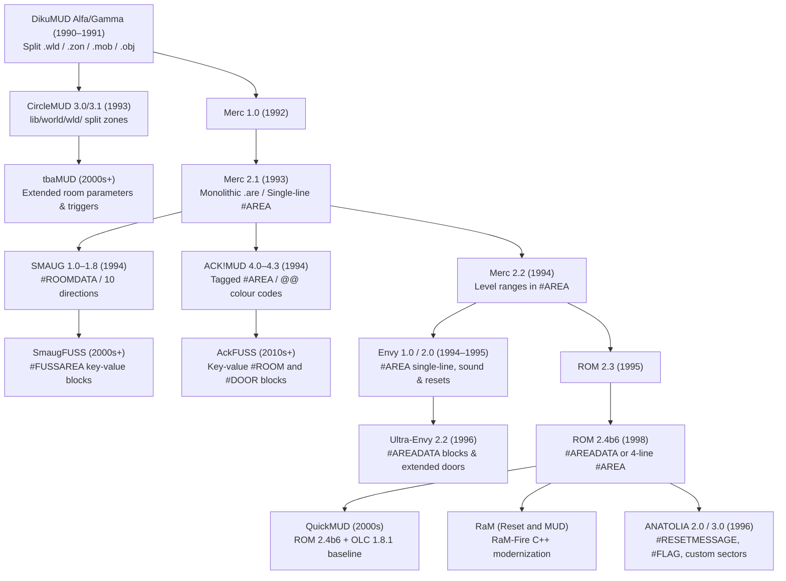
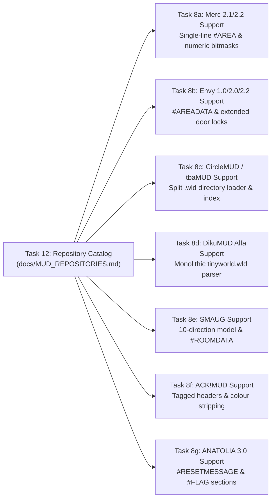

# Public MUD Area Repository Catalog & Dialect Research

This document establishes an authoritative, verified catalog of public open-source GitHub repositories hosting authentic area files across the **ROM (Rivers of MUD)**, **Merc**, **Envy**, **DikuMUD**, and derivative codebase families. It details format specifications, directory layouts, sample iconic zones, syntax idiosyncrasies, and licensing restrictions to guide ROMUtil's multi-dialect expansion.

---

## 1. Executive Summary & Dialect Lineage

Text-based Multi-User Dungeons (MUDs) developed a rich ecosystem of area file formats starting in 1990 with DikuMUD. While all major DIKU derivatives share the conceptual model of rooms, cardinal exits, objects, and mobile entities, the syntactic representations diverged significantly:



---

## 2. Baseline Repository: QuickMUD (ROM 2.4b6)

ROMUtil's existing parser ([`romutil/parser.py`](../romutil/parser.py)) was originally constructed against the **QuickMUD** distribution of ROM 2.4b6.

- **Primary Repository**: [`avinson/rom24-quickmud`](https://github.com/avinson/rom24-quickmud)
- **Archive Mirror**: [`DikuMUDOmnibus/QuickMUD`](https://github.com/DikuMUDOmnibus/QuickMUD)
- **Default Branch**: `master`
- **Target Commit SHA**: `364c26f1b124e238156e3d11b4e72a8992c66b74`
- **Area Directory**: `/area/`
- **Total Area Files**: 53 `.are` files listed in `area/area.lst`

### Area Inventory & Iconic Zones
The QuickMUD distribution includes the standard canonical ROM 2.4 world:
- `midgaard.are`: Central metropolitan hub (143 rooms, 339 exits).
- `school.are`: Instructional academy for novices (59 rooms, 178 exits).
- `smurf.are`: Compact rural village (29 rooms, 63 exits).
- `immort.are`: High-level immortals' council chambers.
- `limbo.are`: Non-spatial holding rooms for uninstantiated objects and players.
- `air.are`, `arachnos.are`, `canyon.are`, `catacomb.are`, `chapel.are`, `draconia.are`, `drow.are`, `dwarf.are`, `eastern.are`, `galaxy.are`, `grave.are`, `haon.are`, `hitower.are`, `hood.are`, `mahntor.are`, `marsh.are`, `mega1.are`, `moria.are`, `newbie2.are`, `nirvana.are`, `ofcol.are`, `ofcol2.are`, `olympus.are`, `plains.are`, `pyramid.are`, `redferne.are`, `sewer.are`, `shire.are`, `thalos.are`, `tohell.are`, `trollden.are`, `valley.are`, `wyvern.are`.

### QuickMUD Area Format Specification
QuickMUD uses a 4-line `#AREA` header:
```text
#AREA
<filename>~
<area_name>~
{ <min_level> <max_level> } <builder>    <area_name>~
<vnum_min> <vnum_max>
```

Room definitions reside under the `#ROOMS` section:
```text
#<vnum>
<name>~
<description>~
<area_number> <room_flags> <sector_type>
D<direction_index>
<exit_description>~
<keyword_list>~
<door_locks> <key_vnum> <destination_vnum>
E
<extra_descr_keyword>~
<extra_descr_text>~
S
```

Where:
- `direction_index` in {0=North, 1=East, 2=South, 3=West, 4=Up, 5=Down}.
- `door_locks` in {0=open, 1=door, 2=pickproof}.
- `room_flags` is an integer or letter-encoded bitvector (`A-Z`, `a-z`).
- Section terminates with `#0`.

---

## 3. Verified Public MUD Repository Registry

The following table catalogs verified, publicly accessible open-source GitHub repositories hosting authentic MUD area files across all major lineages:

| Repository Name | Codebase Dialect | GitHub URL | Branch | Target Commit SHA | Area Folder Path | Area File Count | Sample Iconic Zones | Distribution License |
| :--- | :--- | :--- | :--- | :--- | :--- | :--- | :--- | :--- |
| **QuickMUD** | ROM 2.4b6 / QuickMUD | https://github.com/avinson/rom24-quickmud | master | 364c26f1b124e238156e3d11b4e72a8992c66b74 | /area/ | 53 | midgaard.are, school.are, smurf.are | ROM + Merc + Diku (Non-Commercial) |
| **ROM 2.4b6** | ROM 2.4b6 (OLC 1.8.1) | https://github.com/DikuMUDOmnibus/ROM | master | f03fc881e1b7c9e06465bc61d86d28317fd52a6b | /area/ | 53 | midgaard.are, school.are, draconia.are | ROM + Merc + Diku (Non-Commercial) |
| **RaM-Fire** | RaM (Reset and MUD) | https://github.com/DikuMUDOmnibus/RaM-Fire | master | 9ad7a9dfe50eb8d8ca1f60be08c70fe23b965fd2 | /Fire/area/ | 53 | midgaard.are, school.are, catacomb.are | ROM + Merc + Diku + RaM (Non-Commercial) |
| **Merc 2.1** | Merc 2.1 | https://github.com/alexmchale/merc-mud | master | 358bed459176ce54ef5560ab52e5939d683ab21a | /area/ | 45 | midgaard.are, smurf.are, moria.are | Merc 2.1 + Diku (Non-Commercial) |
| **Merc 2.2** | Merc 2.2 | https://github.com/iam-TJ/merc | master | 51320cd4b5eff3143e99381ba68966d73eb99d4f | /area/ | 49 | midgaard.are, smurf.are, chapel.are | Merc 2.2 + Diku (Non-Commercial) |
| **EnvyMUD** | Envy 2.0 | https://github.com/lolindrath/EnvyMUD | master | 0bab3b701ab23247d2788cf37335106adbedb85c | /area/ | 66 | midgaard.are, canyon.are, castle.are | Envy + Merc + Diku (Non-Commercial) |
| **Ultra-Envy** | Ultra-Envy 2.2 | https://github.com/DikuMUDOmnibus/Ultra-Envy | master | 240666877f5c616bfbf9af803bd9dbade0f48bd3 | /area/ | 69 | midgaard.are, arena.are, galaxy.are | Envy + Merc + Diku (Non-Commercial) |
| **DikuMUD Alfa** | DikuMUD Alfa / Gamma | https://github.com/Seifert69/DikuMUD | master | 81b74dce0436b782d08b19064e32013c73525b45 | /dm-dist-alfa/lib/ | 1 | tinyworld.wld (Temple 3001, Void 0) | DIKU Copyright (Strict Non-Commercial) |
| **DikuMUD III** | DikuMUD III / VME | https://github.com/Seifert69/DikuMUD3 | master | 2f72cbfd41f24e60210a83a303fcfc9575c04f57 | /vme/zone/ | 62 | midgaard.zon, arena.zon, udgaard.zon | GPLv3 / DikuMUD3 License |
| **CircleMUD 3.1** | CircleMUD 3.1 | https://github.com/Yuffster/CircleMUD | master | 12a0cedbb563465029c46de9537c96854bc11610 | /lib/world/wld/ | 29 | 30.wld, 31.wld, 35.wld (Moria) | CircleMUD + Diku (Non-Commercial) |
| **tbaMUD** | tbaMUD (CircleMUD 3.54+) | https://github.com/tbamud/tbamud | master | bd92753e29f12113ccb5ca9c303927ea168ef640 | /lib/world/wld/ | 189 | 30.wld, 100.wld (TBA Academy), 1.wld | CircleMUD + Diku (Non-Commercial) |
| **SmaugFUSS** | SmaugFUSS 1.9 (SMAUG 1.8b) | https://github.com/Arthmoor/SmaugFUSS | master | 0aff8ad04e12d17084f4aaeaed6d158937d425cd | /area/ | 25 | astral.are, chapel.are, dwarven.are | SMAUG + Merc + Diku (Non-Commercial) |
| **SMAUG Core** | SMAUG 1.4a / 1.8 | https://github.com/smaugmuds/_smaug_ | master | a13b913cec1e7c8c5732f20b799cb609ebad67f6 | /db/area/ | 121 | db/area/astral.are, db/area/bazaar.are | SMAUG + Merc + Diku (Non-Commercial) |
| **ANATOLIA** | ANATOLIA 3.0 | https://github.com/jaromil/anatoliamud | master | 2b2ee2cc30c9c983f7ca853f0891e85dc75802d5 | /lib/areas/ | 109 | midgaard.are, anatolia.are, antharia.are | Anatolia + ROM + Merc + Diku |
| **AckFUSS** | AckFUSS (ACK!MUD 4.3.1) | https://github.com/Kline-/ackfuss | master | 6404aa5d00ca13e7e13b90f1934611143ed5d989 | /area/ | 10 | calor.are, ceiling.are, dmarena.are | ACK!MUD + Merc + Diku (Non-Commercial) |
| **AckMUD Classic** | ACK!MUD 4.3 | https://github.com/DikuMUDOmnibus/AckMUD | master | a2b2e17373b3b95bb8acce747ea1db17afba7bd3 | /area/ | 40 | ackschool.are, asylum_grounds.are | ACK!MUD + Merc + Diku (Non-Commercial) |

---

## 4. Codebase Dialect Breakdown & Format Specifications

### 4.1. ROM Family (ROM 2.4b6, QuickMUD, RaM)
- **Lineage**: Developed by Alander (Russ Taylor), Brian Moore, and Gabrielle Taylor starting in 1993, culminating in ROM 2.4b6 (1998). QuickMUD integrated Ivan Toledo's OLC 1.8.1 editor and color code handling. RaM (Reset and MUD) modernized ROM into clean C and C++.
- **Header Structure**:
  - QuickMUD: 4-line plain `#AREA` format (`filename~`, `name~`, `credits~`, `min max`).
  - ROM 2.4b6 OLC & RaM-Fire: Key-value `#AREADATA` block terminated by `End`:
    ```text
    #AREADATA
    Name        Midgaard~
    Builders    None~
    VNUMs       3000 3399
    Security    9
    Credits     { All } Diku    Midgaard~
    End
    ```
- **Idiosyncrasies**:
  - Room and mobile flags can appear as integer bitmasks or case-sensitive alphabetical bitvectors (`A-Z`, `a-z`).
  - Door locks support standard states `0` (open), `1` (is door), `2` (pickproof).
  - `#RESETS` sections contain room-level entity assignments: `M` (mobiles), `O` (objects in rooms), `P` (objects in containers), `G` (objects given to mobs), `E` (equipped objects), `D` (door states), and `R` (randomize exit directions).

### 4.2. Merc Family (Merc 2.1, Merc 2.2, Farside MUD)
- **Lineage**: Authored by Furey (Michael O'Keene), Hatchet (Michael Quan), and Kahn (Erwin Andreasen) in 1992–1994. Merc simplified DikuMUD into monolithic `.are` text files. Farside MUD (later rebranded A.V.A.T.A.R. MUD) migrated from LPMUD to Merc 2.2 in 1994, but remained closed-source/proprietary.
- **Header Structure**:
  - Merc 2.1: Single-line tab-separated header: `#AREA\t{ All } Diku    Midgaard~`
  - Merc 2.2: Single-line header specifying level boundaries: `#AREA\t{ 5 15 } Kahn    Newbie Area~`
  - Neither Merc 2.1 nor 2.2 contains filename or VNUM range lines below `#AREA`.
- **Idiosyncrasies**:
  - Pure integer bitmasks for room flags (`ROOM_DARK=1`, `ROOM_NO_MOB=4`, `ROOM_INDOORS=8`).
  - No OLC metadata sections (`#AREADATA`).
  - Exits (`D0` through `D5`) strictly expect 3 trailing integers: `<door_flags> <key_vnum> <to_room_vnum>`.

### 4.3. Envy Family (Envy 1.0, Envy 2.0, Ultra-Envy 2.2)
- **Lineage**: Released in 1994–1996 by Kahn, Hatchet, and Quan as an optimized, clean continuation of Merc 2.2. Ultra-Envy 2.2 added advanced clans, weapon damages, and extended OLC.
- **Header Structure**:
  - Envy 2.0: Retains Merc 2.2 single-line `#AREA\t{ a b } Author Name~`.
  - Ultra-Envy 2.2: Employs an extended `#AREADATA` block including `Recall`, `Reset`, and `Levels`:
    ```text
    #AREADATA
    Name        Midgaard~
    Author      Diku~
    Levels      0 54
    Security    1
    VNUMs       3000 3383
    Builders    None~
    Recall      3001
    Reset       You hear the patter of little feet.~
    End
    ```
- **Idiosyncrasies**:
  - Door state flags introduce `EX_ISDOOR=1`, `EX_CLOSED=2`, `EX_LOCKED=4`, `EX_PICKPROOF=8`, `EX_PASSPROOF=16`, `EX_SECRET=32`.
  - Sound descriptions and extra description blocks (`E`) can appear on rooms or objects.
  - Reset command format supports extended arguments for mob placement.

### 4.4. DikuMUD Core & CircleMUD Families (Diku Alfa, CircleMUD 3.1, tbaMUD)
- **Lineage**:
  - DikuMUD was created in 1990 at DIKU (University of Copenhagen) by Hans Henrik Stærfeldt, Katja Nyboe, Tom Madsen, Michael Seifert, and Sebastian Hammer.
  - CircleMUD was authored in 1993 by Jeremy Elson at Johns Hopkins University, modernizing DikuMUD Alfa into an ANSI C engine.
  - tbaMUD (The Builder Academy) continues CircleMUD maintenance into the modern era.
- **File Structure**:
  - Unlike Merc/ROM's monolithic `.are` files, DikuMUD Alfa and CircleMUD split world data across dedicated directories and files:
    - `wld/` or `.wld`: Rooms and directional exits.
    - `zon/` or `.zon`: Zone reset configurations and tick timers.
    - `mob/` or `.mob`: Mobile definitions.
    - `obj/` or `.obj`: Object prototypes.
    - `shp/` or `.shp`: Merchant shop tables.
  - Directory lookup uses an `index` manifest file listing active zone numbers (e.g. `30.wld`, `31.wld`).
- **Room Format Specification (`.wld`)**:
  ```text
  #<vnum>
  <room_name>~
  <room_description>~
  <zone_number> <room_flags> <sector_type>
  D<direction_number>
  <exit_description>~
  <keyword_list>~
  <door_state> <key_vnum> <to_room_vnum>
  E
  <extra_descr_keyword>~
  <extra_descr_text>~
  S
  ```
  - Room terminates with `S` (Stop/Section sentinel).
  - In CircleMUD 3.1, `room_flags` is a lowercase alphabetical bitvector (e.g. `cdeh`) or an integer.
  - In tbaMUD, the room parameter line is extended to 6 fields: `<zone> <room_flags> <sector> <max_occupants> <min_level> <max_level>`.

### 4.5. Derivations: SMAUG, ANATOLIA, ACK!MUD
- **SMAUG (Realms of Despair / SmaugFUSS)**:
  - Authored by Derek Snider in 1994, derived from Merc 2.1.
  - Features 10 directional exits: Cardinal (`0=n, 1=e, 2=s, 3=w, 4=u, 5=d`), Intercardinal (`6=ne, 7=nw, 8=se, 9=sw`), and special (`10=somewhere`).
  - SmaugFUSS uses modern key-value blocks (`#FUSSAREA`, `#AREADATA ... #ENDAREADATA`, `#ROOM ... End`).
- **ANATOLIA 3.0**:
  - Forked from ROM 2.4b4 by Hamid, Dalsun, Ilya, and Murat in 1996.
  - Injects custom top-level area sections: `#RESETMESSAGE <text>~` and `#FLAG <flags>`.
  - Introduces battle arena room flags (`ROOM_ARENA`, `ROOM_BATTLE_ARENA`), clan alignments, and multi-class restrictions.
- **ACK!MUD / AckFUSS**:
  - Created by Stephen McCarthy and Alander in 1994 from Merc 2.1; modernized by Kline into AckFUSS.
  - ACK!MUD 4.3 uses single-letter tagged lines under `#AREA` (`Q`, `K`, `L`, `N`, `I`, `V`, `X`, `F`, `U`, `O`, `R`, `W`, `M`).
  - AckFUSS uses key-value `#ROOM` and `#DOOR` sections with `End` delimiters.
  - Inlines custom colour markup: `@@y` (yellow), `@@b` (blue), `@@R` (bold red), `@@N` (reset).

---

## 5. Comparative Syntax Matrix

| Feature | ROM 2.4b6 / QuickMUD | Merc 2.1 / 2.2 | Envy 2.0 / Ultra-Envy | Diku Alfa / CircleMUD | SMAUG / SmaugFUSS | ACK!MUD / AckFUSS |
| :--- | :--- | :--- | :--- | :--- | :--- | :--- |
| **File Model** | Monolithic `.are` | Monolithic `.are` | Monolithic `.are` | Split `.wld` / `.zon` | Monolithic `.are` | Monolithic `.are` |
| **Area Header** | 4-line `#AREA` or `#AREADATA` | 1-line `#AREA\t{ levels }` | 1-line `#AREA` or `#AREADATA` | No header (Zone in `.zon`) | `#FUSSAREA` / `#AREADATA` | Tagged lines or `#AREA..End` |
| **Directions** | 6 (`D0`–`D5`) | 6 (`D0`–`D5`) | 6 (`D0`–`D5`) | 6 (`D0`–`D5`) | 10 (`D0`–`D9` + special) | 6 (`D0`–`D5`) |
| **Room Sentinel** | `S` | `S` | `S` | `S` | `End` or `S` | `End` or `S` |
| **Door Format** | `D{0..5}\ndesc~\nkey~\nflags key dst` | `D{0..5}\ndesc~\nkey~\nflags key dst` | `D{0..5}\ndesc~\nkey~\nflags key dst` | `D{0..5}\ndesc~\nkey~\nflags key dst` | `Door <dir>` or `#EXIT` block | `D{0..5}` or `#DOOR` block |
| **Bitvector Format** | Mixed numeric / `A-Z a-z` | Strict Integer bitmask | Numeric bitmask | Alphabetic (`cdeh`) or numeric | String flags (`dark`, `nomob`) | Tagged letter codes |
| **Colour Markup** | None or `{r`, `{x` (ROM/OLC) | None | None | None | `&r`, `&w` | `@@r`, `@@N` |

---

## 6. Licensing & Distribution Permissions Matrix

All analyzed codebases trace their legal heritage to the original 1990/1991 DikuMUD license, creating a cascading stack of attribution requirements:

| License Tier | Originators | Core Terms & Distribution Restrictions |
| :--- | :--- | :--- |
| **DikuMUD License** | Hans Henrik Stærfeldt, Katja Nyboe, Tom Madsen, Michael Seifert, Sebastian Hammer (1990–1991) | - **Strictly Non-Commercial**: No financial profit or revenue may be derived from the software or derived works.<br/>- **Mandatory Login Attribution**: DIKU copyright notice must appear on user connect/login screen.<br/>- **Source Preservation**: Original copyright notices must remain intact in all source files. |
| **Merc License** | Michael O'Keene, Michael Quan, Erwin Andreasen (1992–1994) | - Inherits all DikuMUD restrictions.<br/>- **Help Screen Credit**: Must provide a `help merc` command documenting authors.<br/>- **Login Banner**: Must display Merc credits during connection sequence. |
| **ROM License** | Russ Taylor, Brian Moore, Gabrielle Taylor (1993–1998) | - Inherits all DikuMUD and Merc restrictions.<br/>- **ROM Credit Display**: Must display ROM copyright on connect and in `help rom`.<br/>- Prohibits charging fees for access, hosting, or derived services. |
| **CircleMUD License** | Jeremy Elson (1993–2002) | - Inherits DikuMUD non-commercial terms.<br/>- Retains Jeremy Elson copyright; requires CircleMUD credits in login screen and documentation.<br/>- Free for non-commercial educational and hobbyist use. |
| **SMAUG License** | Derek Snider, Realms of Despair (1994–1996) | - Inherits DikuMUD and Merc restrictions.<br/>- Requires SMAUG credit screen and retaining all author comments. |
| **Envy / ACK! Licenses** | Kahn, Hatchet, Quan / Stephen McCarthy | - Inherits DikuMUD and Merc restrictions.<br/>- Requires author recognition in credit/help displays. |

### Legal Compliance for ROMUtil
ROMUtil functions as an **offline analysis, spatial layout, and visualization tool**. It parses area files stored on local filesystems to compute geometric coordinate embeddings and SVG visualizations:
1. **Zero Proprietary Code Linking**: ROMUtil is an independent Python clean-room implementation; it does not link against, compile, or distribute any vintage C server binaries.
2. **Non-Commercial Invariance**: ROMUtil is free and open-source under the MIT License, adhering to the non-commercial requirements of upstream MUD licenses.
3. **Data File Decoupling**: Area files remain in their respective external repositories or local directories; ROMUtil ingests them via path references without re-licensing upstream creative writing.

---

## 7. Downstream Compatibility Roadmap

To expand ROMUtil from a ROM 2.4 engine into a universal MUD spatial layout system, dialect compatibility is broken down into modular child tasks:



### Decomposed Backlog Tasks:
1. **Task 8a: Merc 2.1 & 2.2 Grammar & Ingestion**:
   - Update `romutil/parser.py` to accept single-line `#AREA\t{ level_range } Author Name~`.
   - Support areas omitting trailing VNUM ranges by dynamically deriving bounds from parsed rooms.
   - Map numeric integer room flags directly to domain models.
2. **Task 8b: Envy 1.0, 2.0 & Ultra-Envy 2.2 Grammar**:
   - Add `#AREADATA ... End` token stream reduction in PLY parser.
   - Parse extended door state bitmasks (`EX_PASSPROOF=16`, `EX_SECRET=32`).
   - Tolerate room sound descriptors and custom resets.
3. **Task 8c: CircleMUD 3.1 & tbaMUD Split World Database Ingestion**:
   - Implement `WorldDirectoryLoader` to read `lib/world/wld/index` and parse individual zone `.wld` files.
   - Support `S` room terminators and lowercase bitvector strings (`cdeh`).
   - Support 6-parameter tbaMUD room header lines.
4. **Task 8d: DikuMUD Alfa / Gamma Ingestion**:
   - Support multi-zone single-file `tinyworld.wld` formats.
   - Handle legacy VNUM 0 (The Void) as a valid room node.
5. **Task 8e: SMAUG & SmaugFUSS 10-Direction Spatial Modeling**:
   - Extend `Direction` enum in `romutil/models.py` with diagonal intercardinal vectors: `Northeast` (+1, +1, 0), `Northwest` (-1, +1, 0), `Southeast` (+1, -1, 0), `Southwest` (-1, -1, 0).
   - Add `#FUSSAREA` and key-value `#ROOM` block parsing.
6. **Task 8f: ACK!MUD / AckFUSS Ingestion & Colour Sanitization**:
   - Add pre-lexer sanitization pipeline to strip `@@<color>` markup tokens from room names and descriptions.
   - Parse single-character tagged `#AREA` lines (`Q`, `K`, `V`, etc.).
7. **Task 8g: ANATOLIA 3.0 Section Tolerance**:
   - Add grammar reductions for `#RESETMESSAGE` and `#FLAG` top-level blocks.
   - Retain backward compatibility with standard ROM 2.4b6.
