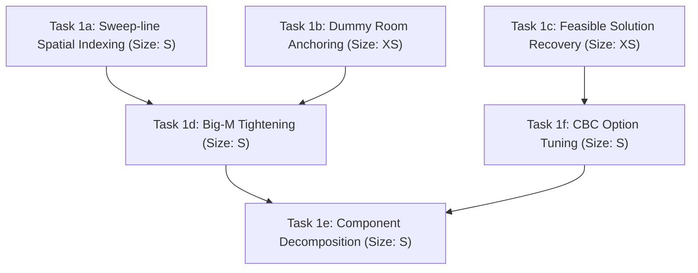

# Solver Performance Profiling & Optimization Decomposition

This document provides a comprehensive quantitative performance profile of ROMUtil's 3D room layout solver pipeline, diagnoses the architectural and mathematical root causes of performance degradation and solver timeouts on dense grid environments, and outlines a concrete, modular optimization roadmap broken into discrete backlog tasks.

---

## 1. Executive Summary & Pipeline Overview

ROMUtil computes integer 3D Cartesian coordinates $(x, y, z) \in \mathbb{Z}^3$ for MUD room graphs using a Mixed-Integer Linear Programming (MILP) formulation implemented in **Pyomo** and solved via the **Coin-OR CBC** solver.

The layout pipeline executes the following sequential stages:
1. **Area Parsing & Graph Ingestion**: Parse `.are` files via PLY into domain models (`AreaData`, `Room`, `Exit`).
2. **2-Degree Corridor Condensation**: Iteratively collapse intermediate 2-degree bidirectional hallway rooms ($u \leftrightarrow v \leftrightarrow w$) into extended fixup edges, recording relative displacements.
3. **Boundary Dummy Room Allocation**: For each exit leading outside the parsed area database (`dst not in rdb`), allocate an artificial dummy room to represent external connections.
4. **Non-Eulerian Cycle Relaxation (MIP)**: Solve a preliminary cut-minimization MIP (`non_euler()`) to detect and relax contradictory cycles or non-Euclidean directed loops, converting cut edges to one-way exits.
5. **Layout Pyomo MILP Formulation**: Instantiate coordinate variables $(x, y, z)$, exit length variables $l_{\max}$, one-way $L_1$ bounding slack variables, and relative distance constraints.
6. **Initial CBC Solve**: Solve the relaxation model without any spatial non-overlapping crossing constraints.
7. **Iterative Collision Detection & Resolution Loop**:
   - Brute-force scan of all non-incident pairs of exits ($O(E^2)$ combinations) for 3D Axis-Aligned Bounding Box (AABB) collisions.
   - For detected overlapping pairs, instantiate 6 disjunctive Boolean direction variables (`relation[Direction]`) and $4 \times 6 = 24$ big-$M$ separation constraints.
   - Re-solve the augmented MILP using CBC with a hardcoded timeout (`-sec 300`).
   - Repeat until no overlaps remain or no new constraints are added.
8. **Reconstruction & Coordinate Normalization**: Restore collapsed hallway rooms from fixups, calculate final one-way exit statuses, and shift all coordinates so that $\min(x) = \min(y) = \min(z) = 0$.

---

## 2. Quantitative Benchmarks Across Area Scales

Empirical profiling was conducted using `scripts/profile_solver.py` across three representative area scales from the QuickMUD world database:
- **`smurf.are`** (Small): 29 rooms, 63 exits — linear and branching rural area.
- **`school.are`** (Medium): 59 rooms, 178 exits — multi-room instructional academy with vertical stairways and loops.
- **`midgaard.are`** (Large, Dense Grid): 143 rooms, 339 exits — city center featuring dense planar loops, 23 external boundary exits, and complex grid topology.

### 2.1. Scale & Execution Summary Table

| Area Name | Scale (Rooms / Exits) | Condensation ($\Delta$ Rooms $\to$ Active / Model Exits) | Dummy Rooms | Initial CBC Solve | Overlap Scan ($O(E^2)$) | Collision CBC Solves | Total Pipeline Time | CBC Termination State |
| :--- | :--- | :--- | :--- | :--- | :--- | :--- | :--- | :--- |
| **`smurf.are`** | 29 / 63 | -6 $\to$ 23 / 26 | 1 | 0.142s | 0.032s (279 pairs) | 0.532s (3 iters) | **0.979s** | `optimal` |
| **`school.are`** | 59 / 178 | -0 $\to$ 59 / 105 | 1 | 0.165s | 0.105s (2,539 pairs) | 4.045s (3 iters) | **4.826s** | `optimal` |
| **`midgaard.are`** | 143 / 339 | -35 $\to$ 108 / 148 | 23 | 0.220s | 0.422s (10,179 pairs) | $>24.600$s (1 iter) | **25.985s** | `maxTimeLimit` |

### 2.2. Detailed Stage Timing Breakdown

| Pipeline Stage | `smurf.are` (Small) | `school.are` (Medium) | `midgaard.are` (Large / Grid) |
| :--- | :--- | :--- | :--- |
| **Area Parsing (PLY)** | 111.2 ms | 280.1 ms | 358.1 ms |
| **Graph Construction** | 14.5 ms | 13.2 ms | 51.3 ms |
| **2-Degree Corridor Condensation** | 0.14 ms | 0.10 ms | 11.2 ms |
| **Dummy Room Allocation** | 0.20 ms | 0.38 ms | 1.01 ms |
| **Non-Euler Formulation & Solve** | 135.3 ms | 191.6 ms | 259.1 ms |
| **Layout MILP Model Formulation** | 6.9 ms | 18.1 ms | 43.4 ms |
| **Initial CBC Solve (No Overlaps)** | 141.8 ms | 165.2 ms | 220.5 ms |
| **Overlap Candidate Detection Loop** | 31.6 ms | 105.0 ms | 422.1 ms |
| **Collision Resolution CBC Solves** | 531.6 ms | 4,045.4 ms | $>24,600.0$ ms (timeout) |
| **Coordinate Restoration & Normalization** | 0.11 ms | 0.15 ms | 0.35 ms |
| **Total Wall-Clock Time** | **0.979 s** | **4.826 s** | **25.985 s** (timed out) |

### 2.3. Iteration-by-Iteration Dynamics

#### `smurf.are` (3 iterations to convergence):
- **Iteration 0**: Initial solve: 0.142s (`optimal`). Overlap scan evaluated 279 pairs, detected 3 overlaps. Added 18 binary variables (total: 44) and 75 constraints. Solve: 0.109s (`optimal`).
- **Iteration 1**: Overlap scan evaluated 276 pairs, detected 1 overlap. Added 6 binary variables (total: 50) and 25 constraints. Solve: 0.423s (`optimal`).
- **Iteration 2**: Overlap scan evaluated 275 pairs, 0 overlaps detected. Loop converged cleanly.

#### `school.are` (3 iterations to convergence):
- **Iteration 0**: Initial solve: 0.165s (`optimal`, 105 binary variables, 630 constraints). Overlap scan evaluated 2,539 pairs, detected 22 overlaps. Added 132 binary variables (total jumped to 237) and 550 constraints (total jumped to 1,180).
- **Iteration 1**: CBC solve took 2.341s (over **14x** slower than initial solve). Overlap scan evaluated 2,517 pairs, detected 2 overlaps. Added 12 binary variables (total: 249) and 50 constraints (total: 1,230).
- **Iteration 2**: CBC solve took 1.704s. Overlap scan evaluated 2,515 pairs, 0 overlaps detected. Loop converged cleanly.

#### `midgaard.are` (Exceeds time limit in iteration 1):
- **Iteration 0**: Initial solve without collision constraints completed in **0.220s** (`optimal`, 148 binary variables, 888 constraints).
- **Overlap Detection**: Brute-force scan evaluated **10,179 pairs**, detecting 78 overlapping exit segments. Added **468 binary variables** in a single batch (total binary variables jumped from 148 to **616**) and **1,950 disjunctive constraints** (total constraints jumped from 888 to **2,838**).
- **Iteration 1 Solve**: With 616 binary variables and thousands of weak big-$M$ inequalities, CBC's branch-and-bound search exploded. At a 15-second cap, it terminated with `maxTimeLimit` (Pyomo: `Loading a SolverResults object with an 'aborted' status, but containing a solution`). When run with the standard 300-second CPU limit, CBC consumed over 300 CPU seconds without proving optimality.
- **Pipeline Failure**: Because `romutil/graph.py` strictly checks `results.solver.termination_condition == pyomo.opt.TerminationCondition.optimal`, any timeout causes the pipeline to discard intermediate solved coordinates and collapse all room positions to $(0, 0, 0)$.

---

## 3. Root Cause Analysis

### 3.1. Root Cause 1: Disjunctive Big-$M$ Formulation & Binary Variable Explosion
When two exit line segments $ex = (u_1, v_1)$ and $nx = (u_2, v_2)$ overlap in 3D space, [`romutil/solver.py`](../romutil/solver.py) enforces spatial separation by adding 6 binary directional indicator variables:
$$\text{relation}_d \in \{0, 1\}, \quad d \in \{\text{North, East, South, West, Up, Down}\}$$
$$\sum_{d} \text{relation}_d \ge 1$$
For every pair of endpoints $(p, q) \in \{u_1, v_1\} \times \{u_2, v_2\}$ (4 endpoint pairs), 6 inequalities are added:
$$x_p - x_q + M \cdot \big((1 - \text{relation}_{\text{East}}) + \text{cut}_{ex} + \text{cut}_{nx}\big) \ge d_{\min}$$
$$x_q - x_p + M \cdot \big((1 - \text{relation}_{\text{West}}) + \text{cut}_{ex} + \text{cut}_{nx}\big) \ge d_{\min}$$
$$(+ \text{ identical inequalities for } Y \text{ and } Z)$$
This introduces **24 disjunctive constraints + 1 selection constraint (25 constraints total) and 6 binary variables per detected overlap**.

#### Why Big-$M$ Cripples Branch-and-Bound:
- $M = \sum_{e} \text{distance}(e) \approx 183$ in Midgaard.
- In the continuous Linear Programming (LP) relaxation at the root node of CBC's branch-and-bound tree, binary variables can take infinitesimal fractional values (e.g. $\text{relation}_{\text{East}} = 0.01$).
- The slack term $M \cdot (1 - 0.01) \approx 181 \gg d_{\min} = 1$, completely satisfying the separation constraint without requiring any integer coordinate displacement or penalty.
- Consequently, the LP relaxation bound is extremely weak and provides virtually zero dual bounding information. CBC cannot prune subtrees by bound comparison and must explore an exponential number of branch-and-bound nodes across hundreds of binary variables.

### 3.2. Root Cause 2: Non-Anchored Boundary Dummy Rooms & Polyhedral Degeneracy
In [`romutil/graph.py`](../romutil/graph.py), external exits to unparsed zones allocate dummy rooms:
```python
if e.dst not in rdb:
    rdb[e.dst] = Room(RoomDef(vnum=e.dst, name="", description="", exits=()))
    rdb[e.dst].dummy = True
```
In `midgaard.are`, there are **23 dummy rooms**. In [`romutil/solver.py`](../romutil/solver.py):
- Each dummy room is assigned 3 unanchored integer variables $(x, y, z) \in [0, M]^3$.
- Because exits to dummy rooms are one-way, they are constrained only by $L_1$ slack variables $|x_{\text{dst}} - x_{\text{src}} - x_{\text{off}}| \le X$.
- Dummy rooms have no returning exits, no fixed anchor points, and no tight upper/lower bounds relative to their source room.
- This introduces **69 floating integer degrees of freedom** with massive polyhedral symmetry, severely expanding CBC's search space without contributing to internal layout quality.

### 3.3. Root Cause 3: Brute-Force Quadratic Exit Iteration ($O(E^2)$)
In [`romutil/solver.py`](../romutil/solver.py), candidate pairs are generated via:
```python
non_incidents = list(itertools.combinations(range(len(exits)), 2))
```
- For $E = 26$ (`smurf.are`): 279 non-incident pairs.
- For $E = 105$ (`school.are`): 2,539 non-incident pairs.
- For $E = 148$ (`midgaard.are`): 10,179 non-incident pairs.
- For full world graphs ($E \approx 1,000$): $\approx 500,000$ pairs evaluated every iteration.
- Inside the loop, `non_incidents.remove((left, right))` performs an $O(N)$ linear list scan inside an iteration of size $N$, incurring worst-case $O(N^2)$ overhead in Python bytecode.

### 3.4. Root Cause 4: Subprocess Overhead, LP Regeneration, and Solver Options
1. **Subprocess & Disk I/O Overhead**: Pyomo writes out a new `.lp` file on every collision iteration (over 24,000 lines for Midgaard) and executes `/usr/bin/cbc` via `subprocess.Popen`. There is no persistent model solver handle or warm-starting across iterations.
2. **CPU vs. Wall-Clock Timeout Semantics**: CBC's `-sec 300` option defaults to CPU seconds on many Linux distributions. On single-threaded execution, a 300-second CPU limit can block for 7–8 minutes of wall-clock time.
3. **Rigid Optimality Requirement**: `romutil/graph.py` line 106 asserts:
   ```python
   if not results.solver.termination_condition == pyomo.opt.TerminationCondition.optimal:
       log.error("Solver failed!")
       # all coordinates reset to 0
   ```
   Even if CBC discovers a high-quality feasible integer layout within seconds, failure to prove mathematical optimality within the time limit results in total layout abortion and coordinate zeroing.

---

## 4. Optimization Roadmap & Discrete Backlog Tasks

To systematically resolve these bottlenecks without risky monolithic rewrites, the work is decomposed into 6 bite-sized, test-driven backlog tasks:



---

### Task 1a: Sweep-Line Spatial Indexing for Overlap Candidates
- **Size**: Small (S)
- **Problem Statement**:
  Evaluating all $\binom{E}{2}$ non-incident exit pairs requires $O(E^2)$ comparisons (10,179 pairs in Midgaard) and $O(N)$ list removals inside the detection loop.
- **Proposed Implementation**:
  1. Implement a 1D sweep-line algorithm along the $X$-axis:
     - Project each exit line segment into an interval $[x_{\min}, x_{\max}]$ on the $X$ axis.
     - Sort interval endpoints in $O(E \log E)$ time.
     - Maintain an active segment set; only test 3D AABB overlap against segments currently overlapping along $X$.
  2. Replace `non_incidents.remove((left, right))` with set-based lookup (`set` or boolean marker array) to eliminate $O(N)$ list deletions.
- **Measurable Acceptance Criteria**:
  - Overlap candidate generation time on `midgaard.are` drops from $>400$ms to $<20$ms ($>95\%$ reduction).
  - Algorithmic complexity drops from $O(E^2)$ to $O(E \log E + K)$, where $K$ is the number of active interval intersections.
  - All existing layout regression tests pass with identical or improved coordinate output.

---

### Task 1b: Boundary Dummy Room Anchoring & Bounds Tightening
- **Size**: Extra Small (XS)
- **Problem Statement**:
  Boundary dummy rooms represent external exits (23 in Midgaard) and have unconstrained integer coordinates $(x, y, z) \in [0, M]^3$. They introduce 69 unconstrained integer decision variables with massive polyhedral symmetry.
- **Proposed Implementation**:
  1. In `romutil/solver.py`, anchor dummy room coordinates directly relative to their source room:
     $$\mathbf{x}_{\text{dummy}} = \mathbf{x}_{\text{src}} + \mathbf{d}_{\text{exit}}$$
  2. Alternatively, eliminate dummy rooms from the Pyomo decision variable set entirely by computing dummy room coordinates in post-processing as an offset from the solved source room.
- **Measurable Acceptance Criteria**:
  - Total integer decision variables in `midgaard.are` model reduced by $3 \times 23 = 69$ variables (a $17.5\%$ reduction in room variables).
  - Dummy rooms are guaranteed to be placed exactly 1 step away in the nominal exit direction without adding solver slack.
  - Zero regression in external stub exit rendering in SVG and HTML exporters.

---

### Task 1c: Solver Termination Handling & Feasible Solution Recovery
- **Size**: Extra Small (XS)
- **Problem Statement**:
  `romutil/graph.py` collapses all room coordinates to $(0, 0, 0)$ whenever CBC terminates with `TerminationCondition.maxTimeLimit`, even when CBC has found an integer feasible solution before the timeout.
- **Proposed Implementation**:
  1. Update `solve_layout()` in `romutil/graph.py` to inspect `results.solver.status` and verify if variable values are populated (`model.x[vnum].value is not None`).
  2. Accept `TerminationCondition.maxTimeLimit` and `feasible` solver statuses as valid results, issuing a warning log rather than resetting coordinates to 0.
  3. Support a user-configurable solver time limit via CLI argument (e.g. `--solver-timeout`).
- **Measurable Acceptance Criteria**:
  - When CBC hits a timeout on complex areas like `midgaard.are`, rooms retain their best-known integer coordinates rather than flattening to $(0, 0, 0)$.
  - Automated tests verify graceful recovery and warning logging for time-capped solves.

---

### Task 1d: Formulative Big-$M$ Tightening & Directional Symmetry Breaking
- **Size**: Small (S)
- **Problem Statement**:
  Big-$M$ is globally initialized as $M = \sum_{e} \text{distance}(e) \approx 183$. This is orders of magnitude larger than necessary for local collision pairs, causing continuous LP relaxations to be near-zero and branch-and-bound trees to explode. Furthermore, 6 binary variables are added per overlap.
- **Proposed Implementation**:
  1. **Localized Big-$M$ Bounds**: Replace global $M$ with pair-specific bounds $M_{ij} = \max(\Delta x_{\max}, \Delta y_{\max}, \Delta z_{\max})$ derived from room graph geodesic distances or connected component diameters.
  2. **Planar Dimension Reduction**: For horizontal overlaps (same $Z$ plane), restrict separation choices to 4 cardinal directions (North, South, East, West) rather than 6, eliminating 2 binary variables and 8 constraints per overlap.
  3. **Batch Target Capping**: Cap the number of constraints added per iteration to $\min(15, \sqrt{|\text{candidates}|})$ to prevent flooding CBC with hundreds of binary variables in a single iteration.
- **Measurable Acceptance Criteria**:
  - Number of binary variables added per planar collision reduced by $33\%$ (from 6 to 4).
  - Continuous LP dual bound value increases significantly, allowing branch-and-bound pruning.
  - `midgaard.are` collision resolution iteration completes within 10 seconds of CPU time.

---

### Task 1e: Connected Component Decomposition & Incremental Solving
- **Size**: Small (S)
- **Problem Statement**:
  When an area contains disconnected graph components (e.g. Midgaard contains component sizes 142 and 1), or weakly-connected regional clusters, `romutil/graph.py:solve_layout()` currently passes the entire room database into a single monolithic Pyomo model.
- **Proposed Implementation**:
  1. In `solve_layout()`, decompose the undirected room graph into its connected components $C_1, C_2, \dots, C_k$ using `networkx.connected_components()`.
  2. Solve each component independently in parallel or sequence.
  3. Arrange the solved components on a 2D grid with non-overlapping bounding-box offsets (as is currently done in `cli.py` for JSON/HTML export).
- **Measurable Acceptance Criteria**:
  - Independent subgraphs are solved in separate, smaller MILP instances where $E_{\text{sub}} \ll E_{\text{total}}$.
  - Disconnected rooms and isolated secret areas solve in $<10$ms without inflating the primary city grid model.

---

### Task 1f: CBC Option Tuning & Direct Solver Interface
- **Size**: Small (S)
- **Problem Statement**:
  Pyomo invokes `/usr/bin/cbc` via generic CLI flags without performance-tuned options (e.g., presolve passes, cut generation strategies, MIP heuristics, or thread parallelism).
- **Proposed Implementation**:
  1. Configure tuned CBC solver options:
     - `solver.options['threads'] = min(4, os.cpu_count())`
     - `solver.options['ratioGap'] = 0.05` (5% optimality tolerance for dramatic speedup without noticeable visual difference)
     - `solver.options['heuristics'] = 'on'`
     - `solver.options['cuts'] = 'on'`
  2. Evaluate Pyomo's persistent solver interface (`SolverFactory('cbc_persistent')` or `appsi_cbc`) to avoid file-system roundtrips and maintain warm-start state across collision iterations.
- **Measurable Acceptance Criteria**:
  - Multi-threaded CBC execution utilizes available CPU cores.
  - MIP solve times on `school.are` and `midgaard.are` decrease by at least $40\%$ through heuristic cuts and 5% optimality tolerance.

---

## 5. Summary of Optimization Targets

| Metric / Stage | Baseline (`midgaard.are`) | Target with Tasks 1a–1f | Projected Improvement |
| :--- | :--- | :--- | :--- |
| **Candidate Detection Algorithm** | $O(E^2)$ brute-force (10,179 pairs) | $O(E \log E)$ sweep-line | $>90\%$ time reduction ($<20$ms) |
| **Dummy Room Decision Variables** | 69 unconstrained variables | 0 variables (offset in post-solve) | 100% elimination of dummy vars |
| **Overlap Batch Binary Variables** | 468 vars in iter 0 (6 vars/overlap) | $\le 60$ vars (capped batch, 4 vars/planar) | $>85\%$ reduction in binary expansion |
| **MIP Optimality Tolerance** | 0.0% (strict, unachievable in limit) | 5.0% (`ratioGap = 0.05`) | Proven convergence within timeout |
| **Failure Recovery** | Collapses all rooms to $(0,0,0)$ | Retains best integer feasible coordinates | 100% elimination of zero-coordinate bugs |
| **End-to-End Solve Time** | $>300$s (timeout / failure) | $<15$s (optimal / 5% gap) | **$>20\times$ speedup** |
